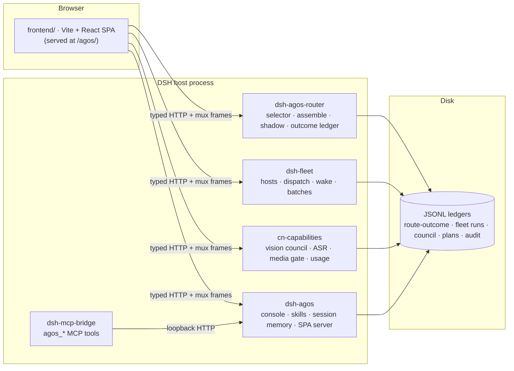

<div align="center">

[](README.md) &nbsp; [](README.zh-CN.md)

</div>

<p align="center">
  
</p>

# AgOS — An Honesty-First Agent Operating System Deck on DeepSeek Harness

### One telemetry deck, five host plugins, and a hard rule: the screen never says anything the data cannot prove.

<p align="center">
  
  
  
  
  
  
</p>

> **A position**: most agent dashboards are optimistic fiction — green badges with no probe behind them, leaderboards built on three samples, "97% healthy" strings typed by hand. AgOS takes the opposite bet: an agent operating system becomes *trustworthy* exactly when its UI is forbidden to decorate. Every number on screen is derived from a ledger on disk; every missing field renders as **“not collected”** instead of a made-up zero; every model-driven suggestion is recorded *before* it is trusted, shadowed *before* it is wired in.

---

## Abstract

**AgOS** is a single-user Agent OS layer for the [DeepSeek Harness](https://github.com/deepseek-ai/deepseek-harness) (DSH) runtime. It replaces the stock web UI with a full **telemetry deck** — multimodal chat, sub-agent lineage, a homelab machine fleet, model routing, skills, plans, and a memory workbench — backed by five DSH plugins that expose everything as auditable JSONL ledgers and typed HTTP routes.

The project explores one question end to end: **what does an agent cockpit look like if fabrication is a build error?** The answer shipped here has three layers. At the UI layer, repo-wide TypeScript AST scanners fail the build when a screen sentence is not computed from the payload it describes, when a write endpoint appears outside a single quarantined file, or when a banned verdict literal sneaks back in. At the decision layer, the LLM route selector runs in *shadow mode* — its suggestions are written to a ledger next to the human's actual choice, and only fleet terminal states may score them. At the heuristics layer, the session-memory extractor ships with a labeled corpus and a per-sample regression gate: a rule edit that breaks any previously-passing sample turns the suite red, and accepting a new baseline is an explicit, named act.

None of this is style guidance. Each rule in [§2](#2-the-honesty-contract) names the test that enforces it.

---

## Table of Contents

- [1. Problem Statement](#1-problem-statement)
- [2. The Honesty Contract](#2-the-honesty-contract)
- [3. System Architecture](#3-system-architecture)
- [4. The Twelve Surfaces](#4-the-twelve-surfaces)
- [5. HTTP API Reference](#5-http-api-reference)
- [6. The Data Layer: Ledgers on Disk](#6-the-data-layer-ledgers-on-disk)
- [7. Shadow Routing](#7-shadow-routing)
- [8. Session Memory and the Ruler](#8-session-memory-and-the-ruler)
- [9. Verification Infrastructure](#9-verification-infrastructure)
- [10. Getting Started](#10-getting-started)
- [11. Development](#11-development)
- [12. Limitations](#12-limitations)
- [License & Credits](#license--credits)

---

## 1. Problem Statement

### 1.1 Three ways agent dashboards lie

1. **Decorated state.** A status pill says "healthy" because a designer chose green, not because a probe returned. The sentence on screen is a string constant; the data it claims to summarize was never consulted.
2. **Invented zeros.** A field the collector never captured renders as `0`, `false`, or an empty bar — indistinguishable from a measured zero. Absence of evidence is silently rendered as evidence of absence.
3. **Suggestions obeyed before measured.** A model picks the "best" agent/machine/skill and the UI wires the pick straight into execution. Nobody ever learns how often the picker would have been wrong, because the human's counterfactual choice is never recorded alongside.

### 1.2 Proposition

All three failure modes are *mechanically detectable*, so all three should be build errors — enforced by static locks and unit gates, not by review-time vigilance. AgOS is a working implementation of that proposition on top of a real agent runtime, driving a real multi-machine homelab, with every screen backed by an append-only ledger a human can `cat`.

---

## 2. The Honesty Contract

These are not style guidelines — each is enforced by a test that fails the build.

1. **On-screen claims must be computed from on-screen data.** Sentences about a dataset are functions of the payload, never string constants. Enforced by derived-copy locks that read sibling component source and assert banned verdict literals absent (`routes-model.test.ts`, `console-live.test.ts`, `council-ledger-model.test.ts`), and by SSR content assertions that render components with controlled payloads and check the emitted copy.
2. **Absent ≠ zero ≠ false.** Every nullable telemetry field is typed `number | undefined` and `undefined` renders as “未采集” (not collected) — a first-class UI state with its own copy. Overview sources carry a three-state header (`ready / stale / absent`); the empty state "nothing pending" is only allowed to render when *all* sources are `ready`.
3. **Write endpoints are quarantined.** All mutating `fetch` calls live in exactly one file (`routes-assemble.ts`), checked by a repo-wide AST lock: literal-only URLs against a 5-entry whitelist, no aliasing, no concatenation, no template assembly, and a companion assertion that the fetch-site literals cover the whitelist exactly once. The model-routing `decide` endpoint exists on the backend but is *unreachable from the UI by construction* — the string literal itself is banned across the frontend source tree.
4. **Suggestions are recorded, not obeyed.** The LLM route selector runs in **shadow mode** ([§7](#7-shadow-routing)): one call per dispatch review, written to the ledger with the human's actual choice alongside — agreement is measured, never assumed. Outcome backfill only happens when the suggested machine actually ran the batch; a batch that ran elsewhere never scores the suggestion, and manual win/loss writes on shadow rows are rejected by the backend.
5. **Heuristics carry a ruler.** The session-memory extractor ships with a labeled corpus, per-sample pass baselines, and an `acceptEdit` gate ([§8](#8-session-memory-and-the-ruler)): any previously-passing sample that regresses turns the suite red — improvements cannot offset regressions, and accepting a new baseline requires an explicit environment flag plus a written rules note.
6. **Security gates are tested as gates.** The media route confines reads to a realpath-checked attachments root, sniffs magic bytes for content-addressed files, and treats caller-supplied MIME as an *expectation to verify* — with dedicated unit tests for traversal, symlinks, double extensions, and forged types. Fleet artifact retrieval validates run IDs and relative paths before any SSH command is composed.

---

## 3. System Architecture

### 3.1 Overview



Two deliberate coupling rules shape the design:

- **Plugins couple through files, not imports.** Cross-plugin data flows through shared ledger files on disk. For example `dsh-agos-router` derives fleet outcome rows by reading the fleet run ledger *raw* — deliberately bypassing the fleet plugin's `FleetLedger` class so a read can never trigger its auto-compaction rewrite.
- **The SPA is served from disk per request.** `dsh-agos` serves `frontend/dist` with SPA fallback on every request, so frontend edits never require a host restart.

### 3.2 The five plugins

| Plugin | Role |
|---|---|
| **`dsh-agos`** | The console core: OS-level control panel (sidebar entry + full-frame overlay, zero shell patches), skills audit/studio/evolve, overview aggregation, session metadata (pin/archive), lock-protected auditable session trash, session-memory stores, permission-audit serving, and the SPA static server. |
| **`dsh-agos-router`** | Model routing: an LLM selector over CN model candidates, a rule-based fallback, the route-outcome JSONL ledger, an exploration-aware allocation posterior feeding a planner/implementer/reviewer `assemble()` flow, confirm-gated text-only dispatch tests, and the shadow-mode selector. |
| **`cn-capabilities`** | CN-model capability layer: vision tools (`see_image`, `see_video`, `read_screenshot_text`, `diagnose_screenshot`, `read_diagram`, `read_chart`, `ui_to_code`, `ui_diff`), speech (`speak`, ASR route), image generation, delegation (`delegate_task`), the multi-model **council** with blind arbiter, `plan_run` plan store, browser/CLI tools, and read-only usage metering. |
| **`dsh-fleet`** | Homelab multi-machine concurrency: dispatches self-contained subtasks to remote `dsh --profile headless` workers over ssh+stdin, in-process local subagents, or an explicitly opted-in local Codex SDK host — with wake-on-LAN, health probes (60s SSH multiplexing), per-host concurrency limits, reroute, artifact retrieval, and a scrubbed event ledger. |
| **`dsh-mcp-bridge`** | Exposes the local control plane as a minimal MCP Streamable HTTP server (protocol 2025-03-26) at `POST /mcp`, with five tools: `agos_sessions`, `agos_prompt`, `agos_result`, `agos_swarm_status`, `agos_memory_search`. Four of the five are read-only; only `agos_prompt` starts real model work. |

Key modules, per plugin:

- **`dsh-agos`** — `lib/index.js` (routes, skill-librarian audit + 5-min cache, session manager with delete lock and projection-cache prune/rollback) · `lib/skills-console.js` (multi-root scan, `servedToModel` tagging, cross-root shadowing analysis, index token-budget estimate) · `lib/skills-studio.js` (confirm-gated drafts and description patches) · `lib/skills-evolve.js` (win/loss ledger, lexical shortlist + experience posterior, optional small-model rerank with fallback) · `lib/session-memory.mjs` · `lib/session-trash.mjs` · `lib/yolo-decisions.mjs`.
- **`dsh-agos-router`** — `lib/selector-llm.js` (system-prompt composition, output parsing) · `lib/selector.js` / `lib/fallback.js` · `lib/ledger.js` (append/fold) · `lib/allocation-score.js` (exploration-aware ranking) · `lib/assemble.js` / `lib/dispatch.js` · `lib/shadow.js` · `lib/sanitize.js` (request-body "verified" labels are never trusted).
- **`cn-capabilities`** — `lib/index.js` (tools + ASR/media routes) · `lib/council-record.js` (record shape; disagreements never collapsed) · `lib/usage.mjs` (read-only SQLite + history reads of a local usage cache).
- **`dsh-fleet`** — `lib/fleet-runtime.mjs` (run lifecycle and settlement) · `lib/fleet-ledger.mjs` (event ledger with secret scrubbing) · `lib/fleet-dispatch.mjs` (HTTP dispatch) · `lib/fleet-artifacts.mjs` (safe-path artifact streaming) · `lib/fleet-power.mjs` (wake budgets/polling, sleep gating) · `lib/fleet-codex.mjs` (opt-in Codex SDK host).

### 3.3 Repository layout

```
agos/
├── frontend/               # Vite + React SPA (TypeScript, node:test via tsx)
│   ├── src/pages/          # ChatPage · ConsolePage · MemoryGraphPage · SettingsPage
│   ├── src/components/     # chat/ console/ fleet/ graph/ lineage/ layout/ ui/
│   ├── src/contract/       # vendored DSH host API contract (pinned)
│   ├── src/stores/         # mux client, live session stores
│   ├── src/fold/           # transcript fold engine + replay invariants
│   └── UPSTREAM.pin        # pinned upstream contract version
├── plugins/
│   ├── dsh-agos/           # console core + SPA server
│   ├── dsh-agos-router/    # routing, ledger, shadow selector
│   ├── cn-capabilities/    # vision / speech / council / plans / usage
│   ├── dsh-fleet/          # homelab fleet dispatch
│   └── dsh-mcp-bridge/     # MCP Streamable HTTP bridge
├── regression/             # OpenCLI browser regression + macOS app shell (Swift)
├── scripts/                # iterate.sh · deploy-plugins.sh · dev-links.sh · test-all.sh
└── docs/media/             # banner and static assets
```

### 3.4 The vendored host contract

The SPA talks to the DSH host through a typed API contract vendored at `frontend/src/contract/api/` and pinned by `UPSTREAM.pin`. `npm run verify` includes `vendor:diff`, a recursive diff of the vendored copy against the installed harness's contract directory — any drift fails the build. `upgrade:dsh` re-vendors and re-pins in one step. This turns "the host updated under us" from a runtime surprise into a red CI line.

### 3.5 What the deck consumes but does not ship

AgOS reads several data sources that are produced by the host installation or by companion plugins outside this repository. The deck treats them all as optional: a missing source renders as `absent`/“未采集”, never as an error page or a fabricated zero.

| Consumed source | Produced by | Used for |
|---|---|---|
| `/api/events.mux`, `/api/respond`, session RPCs | DSH host core | Chat transcript, approvals, session matrix |
| `/api/swarm/progress`, `/api/swarm/history` | swarm plugin (external) | Lineage tree and history |
| `/api/trace/sessions` | trace plugin (external) | Trace time-share bars |
| `/api/memory/*` (graph, search, link-suggestions) | memory plugin (external) | Memory workbench graph |
| Permission-adjudication audit JSONL | mode-alignment component (external) | Permission-verdict annotations in Chat, audit route |
| Local usage cache (SQLite + history JSON) | a menu-bar usage app (external) | Provider quota meters (strictly read-only; no live provider probes) |

---

## 4. The Twelve Surfaces

The deck runs at `http://127.0.0.1:3091/agos/`. Twelve navigable surfaces: three top-level workspaces (Chat, Memory, Settings) plus nine console tabs. Every surface maps 1:1 onto a real data source — no page exists without one.

### 4.1 Chat (对话流)

Multimodal conversation with a session sidebar (pinned / recent / archived, full-text search over titles, directories, and transcript content).

- **Approvals as first-class UI**: the approval panel renders allow/reject; "always allow" appears only when the host contract can actually honor it. Remote transcripts render read-only.
- **Permission-verdict annotations**: judge decisions from the adjudication audit attach to the matching tool cards; a missing reason renders “裁判未留理由” (judge left no reason) instead of inventing one.
- **Voice input** with Web-Audio VAD level metering, transcribed via `POST /api/cn/asr`; per-segment voice provenance survives into the submitted message.
- **Vision arbiter card**: three isolated vision backends answer independently; a fourth *blind* arbiter compares them and flags suspected fabrication per panelist.
- **Session trash, not deletion**: deleting moves the session into an audited trash root behind a confirmation modal; a trash panel lists recoverable sessions.
- **Connection honesty**: when the live event stream is down, the new-session button disables with an explicit "events.mux 未连接" tooltip rather than failing silently.

*Backing: host mux + `dsh-agos` + `cn-capabilities`.*

### 4.2 Overview (概览遥测)

An attention inbox merged from four ledgers — lineage failures, pending route outcomes, skill drift, flagged council reviews — plus a session matrix and usage band.

- Each source carries a three-state header: `ready` / `stale` (refresh failed, showing last-good data) / `absent` (not collected).
- The empty state “nothing pending” may only render when all four sources are `ready`; an absent source is named on screen instead.
- Caveat notes are data-derived — e.g. a council read returning exactly the server window size is flagged as possibly truncated.
- Navigation lamps and counts render only when the overview source is `ready`.

*Backing: `/api/agos/overview` + swarm progress + routes ledger + council ledger.*

### 4.3 Machines & Racks (机器与机架)

The homelab fleet: host cards with reachability, power state, in-flight runs, and batch dispatch.

- Visual host state (`reachable / unreachable / waking`) derives only from SSH probe truth; power snapshots are treated as *intent*, never as evidence.
- Wake and sleep actions sit behind an explicit cost-confirmation step.
- A nine-state run vocabulary includes `detached` (connection lost, awaiting reattach) and `lost` (workspace gone) — states most dashboards collapse into "failed".
- The dispatch modal runs the **shadow selector** ([§7](#7-shadow-routing)) on review; an 8-second stall guard keeps SSH probing from wedging the UI in a loading state.

*Backing: `dsh-fleet` + shadow endpoints of `dsh-agos-router`.*

### 4.4 Sessions (会话矩阵)

A live matrix of all host sessions with running/queued/done lamps and jump-to-chat.

- Preset labels and descriptor labels are kept semantically separate — fallback happens only on absence, never by concatenation; three distinct "missing label" situations render distinctly.
- Head+tail truncation (12+10 chars) keeps same-batch sub-agents distinguishable by their `#k (role)` suffix.

*Backing: host session RPC + `dsh-agos` session metadata.*

### 4.5 Lineage (智能体谱系)

Sub-agent genealogy: live batches as a job tree plus a per-day history view.

- Five-state job lamps; duration formatting renders “未采集” for non-finite values.
- The empty state names the exact missing ledger file rather than showing a generic blank.
- The data-source line (`live progress` vs `history file`) is printed on screen.

*Backing: swarm progress + swarm history ledgers.*

### 4.6 Trace (轨迹时间流)

Per-session time breakdown: one stacked LLM-vs-tool duration bar per session, with turn and step counts and 15-second polling (the polling interval is printed on screen).

- Archived sessions get no attach button — guarded via session metadata so a click can never bounce into a different session; if metadata is unavailable the view degrades to *showing* the button rather than silently hiding real sessions.

*Backing: trace timeline route + `dsh-agos` session metadata.*

### 4.7 Plans (计划与目标)

A read-only archive of plan records with derived status (`executed / approved / edited / pending`).

- The words “只读数据源” (read-only data source) and the backing endpoint are printed on the page; error states name the failing endpoint and HTTP status.
- The plan count is cross-checked against the overview total — but only when the overview source is fresh.

*Backing: `cn-capabilities` plan store + overview cross-check.*

### 4.8 Skills (技能注册表 + Studio)

Skill registry audit and a proposal-only studio.

- Per-root badges separate *served-to-model* roots from console-only roots; cross-root shadowing and content drift are audited with severity findings.
- Usage percentages refuse to render until their denominator is `ready`; vanished-usage and never-used skills are surfaced, not hidden.
- The studio drafts skills (name normalization, catalog-collision checks, trigger-eval cases) and only ever *proposes* — every write is confirm-gated.
- Frozen method-copy constants document the epistemics on screen: a call count is not a verdict; model rerank is opt-in and shows an explicit "unavailable" state when the small model cannot be reached.

*Backing: `dsh-agos` skills routes + host RPC skill list.*

### 4.9 Route Decisions (路由决策)

Every model-routing decision as a ledger row: pick, confidence, reason, source, outcome backfill — plus the assemble/dispatch workflow.

- Absent fields render “未采集” — pick, role, task type, candidates, and confidence all have an explicit not-collected rendering.
- Shadow rows carry dedicated copy and **no** manual outcome buttons; their win/loss can only arrive via fleet terminal-state backfill (the backend rejects manual writes with a typed error).
- Manual outcome recording on ordinary pending rows sits behind a confirmation checkbox; assemble and dispatch each have their own confirm step, and dispatch mismatches return a typed `409`.
- The view itself contains no network primitives — an AST lock proves it can only read through its one sanctioned data hook.

*Backing: `dsh-agos-router` ledger routes.*

### 4.10 Outcome Coverage (结果行覆盖)

Five heterogeneous ledgers (route / council / plan / civ / fleet) normalized into seven-field result rows and a `(source, taskType, model)` coverage grid — rendered on the routes tab, below the decisions.

- The grid *refuses semantic merging*: per-source task-type vocabularies are kept apart and never summed across sources, and that refusal is stated in on-screen copy.
- Honesty annotations are printed where the data demands them: council rows' task type is “未采集” because the record's `kind` field is a write-pipeline discriminator, not a task type; arbiter-flagged rows count as failures; a plan "success" only means the sub-agent finished.
- The coverage summary sentence is computed from the grid payload — there is a test proving it is not a constant.

*Backing: the outcomes deriver in `dsh-agos-router`.*

### 4.11 Vision Council Ledger (读图台账)

The archive of multi-model image-review rounds with arbiter verdicts.

- Disagreement highlights render only from the arbiter's own `disagreements` array — never reconstructed by client-side text diffing (a derived-copy lock enforces the removed helper stays removed).
- Records predating a field render “未采集(本条记录早于该字段)” — "not collected (this record predates the field)".
- Rounds with too few valid answers show an explicit *inconclusive* banner instead of a fabricated verdict.
- Images stream through the magic-byte-sniffing media gate.

*Backing: `cn-capabilities` council records + media route.*

### 4.12 Memory Workbench & Settings

**Memory (记忆)** — episodic/semantic/skill memory as a wikilink graph on canvas with four view modes (atlas / ego-local / community via personalized PageRank / supersedes-lineage), debounced search with hit expansion, link suggestions with adopted-suggestion detection, a node inspector, and a session-memory pane. Failure states are quiet, name the HTTP status, and offer a retry. *(Backed by an external memory plugin — see [§3.5](#35-what-the-deck-consumes-but-does-not-ship).)*

**Settings (系统设置)** — a strictly read-only projection of host settings namespaces: per-row provenance chips (user / base / default / protected), protected values rendered only as configured/not-configured, restart-required vs immediate-apply chips, and a button that asks the *host* to open its settings document rather than editing anything in-UI.

---

## 5. HTTP API Reference

41 API routes plus two static prefixes, registered by the five plugins. All routes live on the DSH host web server (default deployment: `127.0.0.1:3091`).

### 5.1 `dsh-agos` — console core

| Method | Path | Purpose |
|---|---|---|
| GET | `/api/agos/overview` | Aggregate KPIs: sessions, plans, skills, lineage counters (soft dependencies — a missing source never 500s) |
| GET | `/api/agos/session-meta` | Session metadata list (pin/archive state) |
| POST | `/api/agos/session-meta/pin` | Pin / unpin a session |
| POST | `/api/agos/session-meta/archive` | Archive / unarchive a session |
| GET | `/api/agos/session-memory` | Read the extracted memory store for one session |
| POST | `/api/agos/session/delete` | Move a session to the audited trash |
| GET | `/api/agos/session-trash` | Recoverable deleted-session list (read-only) |
| GET | `/api/agos/skills` | Skills catalog + audit payload (`?refresh=1` re-scans) |
| GET | `/api/agos/skills/studio` | Read one skill for the studio editor |
| POST | `/api/agos/skills/draft` | Create a skill draft on disk |
| POST | `/api/agos/skills/description` | Patch a skill description (confirm-gated) |
| GET, POST | `/api/agos/skills/evolve` | Propose skill-evolution shortlist / record outcomes |
| GET | `/api/agos/yolo-decisions` | Permission-adjudication audit rows (read-only, per-session whitelist) |
| GET, HEAD | `/agos` *(static prefix)* | Serve the SPA from `frontend/dist` with SPA fallback |

### 5.2 `dsh-agos-router` — routing & ledger

| Method | Path | Purpose |
|---|---|---|
| GET | `/api/agos/routes` | Recent routing-decision ledger entries |
| POST | `/api/agos/routes/decide` | Live routing decision — **unreachable from the UI by construction** |
| GET | `/api/agos/routes/outcomes` | Derived outcome rows across five ledgers (`?kind=` filter) |
| POST | `/api/agos/routes/outcome` | Record one manual outcome (rejected on shadow rows) |
| POST | `/api/agos/routes/annotate` | Append a human annotation to a decision |
| POST | `/api/agos/routes/shadow` | Shadow selector — one POST is at most one model call; `pick` may be `null` |
| POST | `/api/agos/routes/shadow/link` | Link a shadow record to the fleet batch that actually ran |
| GET, POST | `/api/agos/routes/assemble` | Read latest assemble state / propose a team |
| GET, POST | `/api/agos/routes/assemble/dispatch` | Read dispatch state / run a confirm-gated text-only dispatch (`409` on mismatch) |

### 5.3 `cn-capabilities` — CN model capabilities

| Method | Path | Purpose |
|---|---|---|
| GET | `/api/cn/council-records` | Structured council/review ledger |
| GET, POST | `/api/cn/plans` *(prefix)* | List saved plans / edit a plan's goal and steps |
| GET | `/api/usage/providers` | Provider quota from the local usage cache (read-only, no live probes) |
| GET, HEAD | `/api/cn/media` | Media gate: sandboxed, magic-byte-sniffed artifact streaming with Range support |
| POST | `/api/cn/asr` | Speech-to-text (base64 audio, 25 MB cap, server-side transcode) |
| POST | `/api/cn/vision` | Vision Q&A (base64 image, 12 MB cap) |

### 5.4 `dsh-fleet` — homelab fleet

| Method | Path | Purpose |
|---|---|---|
| GET | `/api/fleet/hosts` | All hosts with health, in-flight runs, current task, power state |
| POST | `/api/fleet/dispatch` | Dispatch a prompt to selected hosts as a batch (`202` with runs) |
| GET | `/api/fleet/batches` | List batches (`?include=runs`) |
| GET | `/api/fleet/batch` | One batch's detail |
| POST | `/api/fleet/cancel` | Cancel a batch or a single run |
| GET | `/api/fleet/trace` | Incrementally page a run's live trace by physical line number |
| GET | `/api/fleet/ws` | Browse a remote worker's workspace / read one file |
| GET | `/api/fleet/artifacts` | Artifact manifest for a run |
| GET | `/fleet/artifact/…` *(static prefix)* | Stream one artifact file or a tgz over SSH |
| GET | `/api/fleet/power` | Power state of all remote nodes |
| POST | `/api/fleet/wake` | Wake named hosts (`202` with per-host power states) |
| POST | `/api/fleet/sleep` | Put one host to sleep (requires `confirm`) |
| POST | `/api/fleet/preflight` | Reachability probe + smoke check |

### 5.5 `dsh-mcp-bridge` — MCP

| Method | Path | Purpose |
|---|---|---|
| POST | `/mcp` | JSON-RPC MCP endpoint (Streamable HTTP, 1 MiB body limit): `agos_sessions` · `agos_prompt` · `agos_result` · `agos_swarm_status` · `agos_memory_search` |

---

## 6. The Data Layer: Ledgers on Disk

Everything the deck shows can be `cat`-ed. The ledgers are append-only JSONL unless noted; writers scrub secrets before appending.

| File | Written by | Purpose |
|---|---|---|
| `~/.dsh/logs/route-outcome.jsonl` | `dsh-agos-router` | Routing decisions, outcomes, annotations, shadow suggestions, assemble/dispatch trials |
| `~/.dsh/logs/fleet/runs.jsonl` | `dsh-fleet` | Full fleet run lifecycle + host power events (secret-scrubbed, auto-compacted, 14-day retention) |
| `~/.dsh/logs/council-record.jsonl` | `cn-capabilities` | Multi-model council rounds with arbiter verdicts and per-panelist stats |
| `~/.dsh/logs/plans/plan-*.json` | `cn-capabilities` | One JSON per plan: goal, steps, then execution results written back |
| permission audit JSONL | mode-alignment component (external) | Every mode-escalation request and its adjudication |
| `~/.dsh/agos/skill-allocate.jsonl` | `dsh-agos` | Skill win/loss outcomes feeding the evolve shortlist |
| `~/.dsh/agos/session-memory/*.json` | `dsh-agos` | Per-session extracted memory (atomic write, `0600`) |
| `~/.dsh/agos/delete.log` | `dsh-agos` | Session-deletion audit (`O_APPEND\|O_NOFOLLOW`, fsync) |

### 6.1 Route-outcome ledger anatomy

Six row kinds share one file; a fold pass reconstructs current state:

- **decision** — `{id: dec-…, ts, taskType, role, candidates, pick, confidence, reason, source}`. Shadow decisions add `mode:'shadow'` and a `shadow:{chosen, agreed, tag, items, itemsTotal, hostsFrom}` block, and their `pick` is a *machine*, not a model.
- **`kind:'outcome'`** — backfill `{ref, result:'ok'|'fail', at, source}`; `source` is `manual` for human writes, `fleet-end` for shadow terminal-state backfill.
- **`ev:'annotate'`** — an append-only human note on a decision.
- **`ev:'shadow-link'`** — `{ref, batchId, hosts}`: binds a shadow suggestion to the fleet batch that actually ran.
- **`kind:'assemble'`** — a proposed planner/implementer/reviewer team with per-model allocation scores (fold keeps latest).
- **`kind:'dispatch'`** — a confirm-gated dispatch trial with per-role turns and results (fold keeps latest).

### 6.2 Fleet run event vocabulary

The fleet ledger records events, not summaries: `dispatch · queue · start · reroute · end · cancel · detach · reattach (alive/settled/interrupted/lost) · wake / wake-failed / wake-ready / wake-timeout · sleep / sleep-end / sleep-eligible · smoke · artifact-error`. Prompts are clipped to 400 chars in the ledger, results to 200 k; `interrupted` and `lost` reattach states are terminal for outcome purposes.

### 6.3 Council records

Each round records the question (clipped), every panelist's `{provider, model, ok, ms, error, text, usage}`, the arbiter's verdict, a structured `disagreements` array, and `flagged` panelists (suspected fabrication). Rounds with fewer than two valid answers are stored as *inconclusive* — the ledger keeps the failure, not a synthesized consensus.

### 6.4 Session-memory stores

One JSON document per session: `items[] {kind: fact|constraint|preference|rejected, text ≤200 codepoints, importance 1–5, sourceTurn}` plus a `skippedSensitive` counter — candidates matching secret patterns are dropped *and counted*, so the store is honest about what it refused to remember. The store is explicitly a convenience projection, never authoritative; it participates in the session-trash commit with a tombstone.

---

## 7. Shadow Routing

The route selector is deliberately powerless. When you review a fleet dispatch, AgOS asks a small model which machine *it* would pick — then does nothing with the answer except write it down.

### 7.1 Lifecycle

1. **Review** — opening the dispatch modal's confirm step triggers at most one `POST /api/agos/routes/shadow` call. Candidates are the remote, enabled fleet hosts with their live descriptions (models, tags, concurrency, in-flight load, reachability). **The user's own checkbox selection is not part of the selector's input** — the suggestion is independent by construction.
2. **Record** — the response row lands in the ledger with `mode:'shadow'`, the suggestion (`pick`, may be `null` when the model fails — no fabricated first-candidate fallback), the reason, the candidates seen, and `agreed`: a three-state comparison against what the human actually chose.
3. **Link** — if the dispatch really happens, an `ev:'shadow-link'` row binds the suggestion to the batch ID and hosts.
4. **Backfill** — when the batch reaches a terminal state, the suggestion's outcome is backfilled *only if the suggested machine actually ran it* (reroute resolves to the final machine; `interrupted`/`lost` count as terminal). A batch that ran elsewhere never scores the suggestion, in either direction.

### 7.2 Isolation guarantees

- Shadow rows are excluded from the allocation posterior, the per-`(role, model)` statistics, and the pending/filled outcome counts — they get their own `stats.shadow` lane.
- Manual outcome writes on shadow rows are rejected by the backend with a typed error, and the UI never renders the buttons.
- Re-reviewing the same dispatch does not re-call the model: the shadow signature dedupes on task content, and host-checkbox or timeout changes never trigger a new call (locked by test).
- Cost discipline is structural: one POST is at most one model call, empty candidate or task lists skip the call entirely, and the modal's cost copy is computed from shadow state.

Over time this produces the only thing that can honestly justify automated routing: a record of real suggestions against real human choices with real outcomes, accumulated *before* the selector is given any authority.

---

## 8. Session Memory and the Ruler

`dsh-agos` extracts durable user-stated facts, constraints, preferences, and rejections from session transcripts. Extraction heuristics are exactly the kind of code that silently rots — so the rules ship strapped to a ruler.

### 8.1 Extraction gates

- **Source gate**: only direct user text on the browser/RPC channel is eligible; sub-agent prompts and headless probe traffic are excluded by session-header and source checks.
- **Form vetoes**: questions, tables, code fences, and fragments are vetoed for *all* memory kinds; single-turn tool instructions ("only reply with…", "run X first") are structurally vetoed from becoming persistent constraints.
- **Secret patterns** drop the candidate and increment a counter — refusals are counted, not hidden.

### 8.2 The labeled corpus

Four blocks, each scored separately and honestly: RPC-channel user sentences (294, fully labeled), bare-source rows (102 — proves the source gate works; excluded from precision denominators), known misreports from a deployed environment (8 — the only block the rule author never tuned against, hence the most informative), and assistant sentences for rejected-alternative mining (43; n=2 positives, so recall on it is reported as unevaluable rather than dressed up). The corpus is generated locally by `mine.mjs` from your own session archives and is not distributed; the suite auto-skips when it is absent, while the misreport block and the baseline ship with the repo so the accounting is reviewable.

### 8.3 The `acceptEdit` gate

`baseline.json` stores per-block totals *and per-sample pass IDs* plus a corpus SHA. The gate turns red when: the corpus changes without an explicit corpus-accept flag; **any previously-passing sample regresses** (improvements cannot offset regressions); or new passes appear without an explicit baseline-accept flag and a written rules note. Deliberate trade-offs must name their regressed samples one by one, and the names are recorded in the baseline. Editing a heuristic is allowed; editing one *silently* is not.

---

## 9. Verification Infrastructure

### 9.1 Test matrix

| Package | Tests | Runner |
|---|---|---|
| `frontend/` | 286 | `node:test` via tsx (`npm run verify` = typecheck + tests + build + contract zero-drift) |
| `plugins/dsh-agos` | 84 | `node --test` |
| `plugins/dsh-agos-router` | 68 | `node --test` |
| `plugins/dsh-fleet` | 113 | `node --test` (fake-backend + farm integration suites) |
| `plugins/cn-capabilities` | 28 | `node --test` |
| `plugins/dsh-mcp-bridge` | 4 | `node --test` |
| **Total** | **583** | `scripts/test-all.sh` — zero model calls end to end |

### 9.2 Static locks

The locks are tests that read *source code* as data:

| Lock | Enforces |
|---|---|
| Write-endpoint whitelist (repo-wide AST) | Non-GET route literals only in `routes-assemble.ts`, only the 5 whitelisted paths, no aliasing/concatenation/templates; the `decide` literal banned across the tree; fetch-site literals cover the whitelist exactly |
| RoutesView no-network AST lock | The decisions view contains no fetch/XHR/WebSocket/beacon/Request/EventSource, no network-capable JSX (`form`, `iframe`, `img`, …), no dynamic import; exactly one sanctioned data hook with a pinned signature |
| Three-tier badge ban | Removed trust-tier verdict literals may not reappear in RoutesView or DispatchModal, matched by value after comment stripping |
| Inbox single-source ban | The overview may not carry a hard-coded data-source claim or "pending approval" copy that no console-level source backs |
| Council divergence lock | Divergence marks come from the arbiter's collected array; the removed client-side diff helper must stay removed |
| DispatchModal shadow source lock | Exactly one shadow call site; submit disabled while a shadow call is in flight; signature dedup rules pinned |
| TraceView join lock | Pins the join-control wiring the browser regression cannot see |
| Vendor contract zero-drift | `diff -r` of vendored contract vs installed harness; any output fails verify |

### 9.3 Browser regression

`regression/opencli-regression.sh` drives a real Chrome through a serial OpenCLI bridge session against the live deck — read-only, zero model calls, `doctor`-gated. Roughly 40 fixed checks (navigation across all four workspaces and nine console tabs, plus content assertions) and 0–2 assertions chosen dynamically from the live ledger state; the latest full run reports 41/41. The discipline, stated in the script's comments: **anchors must be texts that turn red on a 404** — an assertion that passes when the page is dead is not an assertion. Example anchors: the fleet pane's SSH-probe timestamp, the quota band's staleness line, the memory star-map's "collected" markers, and shadow-row copy keyed to the ledger's actual shadow rows.

`regression/` also contains a small Swift macOS shell that wraps the deck as a native app.

### 9.4 Replay invariants and golden folds

The transcript fold engine (`frontend/src/fold/`) is checked two ways: seven replay invariants (I1–I7) plus a golden session run against an archive of hundreds of real sessions (`npm run replay`), and byte-identical golden-file comparisons for the fold output. Session archives are consumed read-only.

---

## 10. Getting Started

### 10.1 Requirements

- A DSH host — DSH Desktop or `@deepseek-ai/dsh` (the web host)
- Node ≥ 22
- A DSH profile directory (`~/.dsh/profiles/<name>/`)

### 10.2 Install and deploy

```bash
git clone https://github.com/LeoLin990405/agos && cd agos

# 1. Build the frontend
cd frontend && npm install && npm run build && cd ..

# 2. Copy the plugins into your profile
#    (copies, not symlinks: the host resolves @deepseek-ai/* bare imports
#     from each plugin file's realpath, so plugins must physically live
#     inside the profile tree)
scripts/deploy-plugins.sh
```

### 10.3 Register the plugins

Add the five plugins to your profile — `file:` dependencies in the profile's `package.json`, plus plugin entries in `cordis.patch.yml`:

```yaml
# ~/.dsh/profiles/<profile>/cordis.patch.yml (excerpt)
- id: agos
- id: agos-router
- id: cn-capabilities
- id: fleet
  config:
    hosts:
      - name: worker-1
        kind: remote
        ssh: user@worker-1
        maxConcurrency: 2
- id: mcp-bridge
```

Then run the web host:

```bash
dsh web --port 3091 --no-open
# → http://127.0.0.1:3091/agos/
```

### 10.4 Day-to-day iteration

```bash
scripts/iterate.sh            # build → deploy → restart only if plugin bytes changed → 4-route health check
scripts/iterate.sh --test     # same, with the full red gate in front (a red gate blocks deploy)
```

Frontend-only edits never need a restart — the SPA is read from disk per request. The restart decision is made from the deploy script's checksum-verified change count, not from guesswork.

---

## 11. Development

### 11.1 Running tests in-repo

```bash
scripts/dev-links.sh   # once: gitignored node_modules links so plugin tests
                       # resolve host packages from inside the repo
scripts/test-all.sh    # frontend verify + 5 plugin suites + deploy drift check
```

`test-all.sh` is the complete product gate and makes zero model calls. The memory-ruler suite auto-skips when its locally generated corpus is not present ([§8.2](#82-the-labeled-corpus)).

### 11.2 Why plugins deploy as copies

The DSH host resolves `@deepseek-ai/*` bare imports upward from each plugin file's **realpath**. A symlinked plugin resolves from the link *target*'s directory — outside the profile tree — and fails with `MODULE_NOT_FOUND`. Desktop and web hosts additionally carry two different host package sets. So the repo is the single source of truth and `deploy-plugins.sh` rsyncs checksum-compared copies into each profile; `--check` reports content drift (and its itemize parsing reads the checksum column specifically — an earlier version read the wrong column and reported false zero-drift, which is exactly the class of bug this project exists to kill).

### 11.3 Scripts reference

| Script | Behavior |
|---|---|
| `scripts/iterate.sh` | Optional gate (`--test`) → frontend build (`--no-build` to skip) → deploy → conditional restart on port 3091 (waits for the old process to exit and the new one to answer 200) → health checks on `/agos/`, `/api/agos/routes`, `/api/agos/overview`, `/api/fleet/hosts` |
| `scripts/deploy-plugins.sh` | rsync `-a --delete --checksum` of the five plugins into the desktop and web profile copies; prints `CHANGED=<n>`; `--check` = drift report only |
| `scripts/dev-links.sh` | Creates the two gitignored symlinks used only by in-repo plugin tests |
| `scripts/test-all.sh` | Frontend verify + five plugin suites (each requiring `fail 0`) + deploy drift check |

---

## 12. Limitations

Stated plainly, in the spirit of the thing:

1. **Single-user, localhost-first.** There is no auth layer of its own; the deck binds to the host's web server and assumes a trusted local machine. Do not expose port 3091 to a network you don't trust.
2. **The memory workbench needs an external plugin.** The graph/search/link routes are provided by a separate memory plugin in the host installation; without it the Memory surface renders its quiet absent states.
3. **The ruler measures fit, not generalization.** Most labeled corpus sentences come from a small number of sessions; the corpus README states this and reports in-corpus numbers as fit, not accuracy estimates. The known-misreports block is the only untuned sample set, and the rules honestly fail 3 of its 8 rows that are textually indistinguishable from real constraints.
4. **Shadow evidence accrues slowly.** The shadow selector only learns from real dispatches you actually review; there is no synthetic replay. That is by design, and it means the record grows at the speed of real work.
5. **Ledger scale is homelab scale.** Fold-on-read over JSONL is fast for thousands of rows, not millions. Retention and compaction exist on the fleet ledger; the others are small by nature.
6. **CN-model tooling assumes CN providers.** The council, ASR, and usage metering are built around a specific set of Chinese model providers and a local usage cache; adapting to other providers means editing `cn-capabilities`.

---

## License & Credits

- [MIT](LICENSE).
- The API contract under `frontend/src/contract/` is vendored from [deepseek-harness](https://github.com/deepseek-ai/deepseek-harness) (MIT, © DeepSeek) and kept drift-free by `npm run vendor:diff`.
- Built to run on the DeepSeek Harness plugin runtime (`cordis`); host packages (`@deepseek-ai/*`) are provided by your DSH installation.
- The browser regression is driven through [OpenCLI](https://github.com/jackwener/opencli)'s browser bridge.
