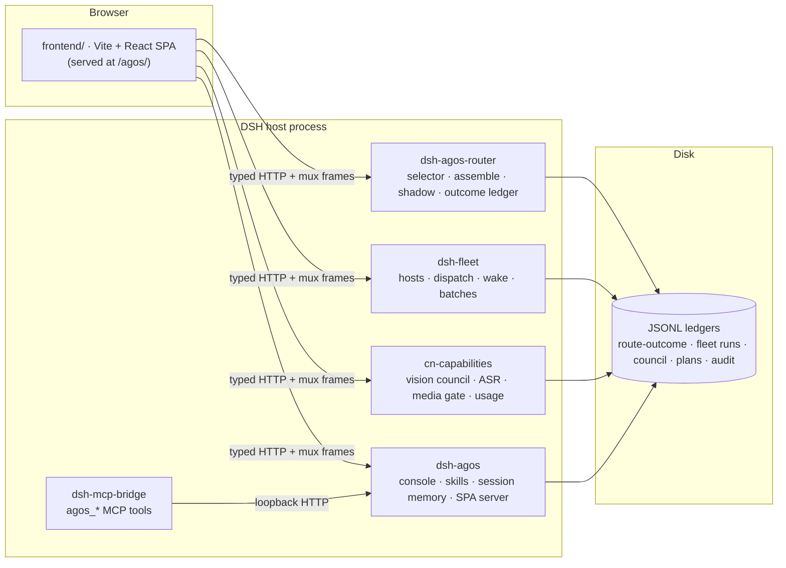

<div align="center">

[](README.md) &nbsp; [](README.zh-CN.md)

</div>

<p align="center">
  
</p>

# AgOS — An Honesty-First Agent Operating System Deck on DeepSeek Harness

### One telemetry deck, five host plugins, and a hard rule: the screen never says anything the data cannot prove.

<p align="center">
  
  
  
  
  
  
</p>

> **A position**: most agent dashboards are optimistic fiction — green badges with no probe behind them, leaderboards built on three samples, "97% healthy" strings typed by hand. AgOS takes the opposite bet: an agent operating system becomes *trustworthy* exactly when its UI is forbidden to decorate. Every number on screen is derived from a ledger on disk; every missing field renders as **“not collected”** instead of a made-up zero; every model-driven suggestion is recorded *before* it is trusted, shadowed *before* it is wired in.

The 2026-09-08 agent design is the product contract: humans keep authority; models propose; memory / skills / assemble share one four-stage loop; secrets have one classifier; allocation is ranking only. The in-repo source of truth is [`docs/AGENT.md`](docs/AGENT.md).

---

## Abstract

**AgOS** is a single-user Agent OS layer for the [DeepSeek Harness](https://github.com/deepseek-ai/deepseek-harness) (DSH) runtime. It replaces the stock web UI with a full **telemetry deck** — multimodal chat, sub-agent lineage, a homelab machine fleet, model routing, skills, plans, and a memory workbench — backed by five DSH plugins that expose everything as auditable JSONL ledgers and typed HTTP routes.

The project explores one question end to end: **what does an agent cockpit look like if fabrication is a build error?** The answer has four layers.

1. **UI** — repo-wide TypeScript AST scanners fail the build when a screen sentence is not computed from the payload it describes, when a `/api/agos/routes*` write appears outside one quarantined file, or when a banned verdict literal sneaks back in.
2. **Authority** — the live route selector `POST /api/agos/routes/decide` exists on the host and is *unreachable from the SPA by construction*. Assemble, skill shortlists, and memory inject never switch the live session model and never start a swarm.
3. **Closed loops** — memory, skills, and model allocation share the same four stages: candidates → rank → expose → operator-confirmed feedback. Exposure is not a win. A missing query is not relevance zero.
4. **Heuristics with a ruler** — the session-memory extractor ships with a labeled corpus and a per-sample regression gate. A rule edit that breaks any previously-passing sample turns the suite red.

None of this is style guidance. Each rule in [§2](#2-the-honesty-contract) names the test that enforces it.

---

## Table of Contents

- [1. Problem Statement](#1-problem-statement)
- [2. The Honesty Contract](#2-the-honesty-contract)
- [3. Agent Design](#3-agent-design)
- [4. System Architecture](#4-system-architecture)
- [5. The Twelve Surfaces](#5-the-twelve-surfaces)
- [6. HTTP API Reference](#6-http-api-reference)
- [7. The Data Layer: Ledgers on Disk](#7-the-data-layer-ledgers-on-disk)
- [8. Shadow Routing](#8-shadow-routing)
- [9. Session Memory and the Ruler](#9-session-memory-and-the-ruler)
- [10. Verification Infrastructure](#10-verification-infrastructure)
- [11. Getting Started](#11-getting-started)
- [12. Development](#12-development)
- [13. Limitations](#13-limitations)
- [License & Credits](#license--credits)

---

## 1. Problem Statement

### 1.1 Three ways agent dashboards lie

1. **Decorated state.** A status pill says "healthy" because a designer chose green, not because a probe returned. The sentence on screen is a string constant; the data it claims to summarize was never consulted.
2. **Invented zeros.** A field the collector never captured renders as `0`, `false`, or an empty bar — indistinguishable from a measured zero. Absence of evidence is silently rendered as evidence of absence.
3. **Suggestions obeyed before measured.** A model picks the "best" agent/machine/skill and the UI wires the pick straight into execution. Nobody ever learns how often the picker would have been wrong, because the human's counterfactual choice is never recorded alongside.

### 1.2 Proposition

All three failure modes are *mechanically detectable*, so all three should be build errors — enforced by static locks and unit gates, not by review-time vigilance. AgOS is a working implementation of that proposition on top of a real agent runtime, driving a real multi-machine homelab, with every screen backed by an append-only ledger a human can `cat`.

---

## 2. The Honesty Contract

These are not style guidelines — each is enforced by a test that fails the build.

1. **On-screen claims must be computed from on-screen data.** Sentences about a dataset are functions of the payload, never string constants. Enforced by derived-copy locks that read sibling component source and assert banned verdict literals absent (`routes-model.test.ts`, `console-live.test.ts`, `council-ledger-model.test.ts`), and by SSR content assertions that render components with controlled payloads and check the emitted copy.
2. **Absent ≠ zero ≠ false.** Every nullable telemetry field is typed `number | undefined` and `undefined` renders as “未采集” (not collected) — a first-class UI state with its own copy. Overview sources carry a three-state header (`ready / stale / absent`); the empty state "nothing pending" is only allowed to render when *all* sources are `ready`.
3. **Route writes are quarantined; decide is banned.** Mutating `/api/agos/routes*` `fetch` calls live in exactly one file (`routes-assemble.ts`), checked by a repo-wide AST lock: five literal URLs, no aliasing, no concatenation, no template assembly. The string `/api/agos/routes/decide` is banned across the frontend source tree. Other confirm-gated writes (skills, session memory, memory desk) live in their own `*-api.ts` modules and are *not* added to that routes whitelist.
4. **Suggestions are recorded, not obeyed.** The LLM route selector runs in **shadow mode** ([§8](#8-shadow-routing)): one call per dispatch review, written to the ledger with the human's actual choice alongside — agreement is measured, never assumed. Outcome backfill only happens when the suggested machine actually ran the batch.
5. **Heuristics carry a ruler.** The session-memory extractor ships with a labeled corpus, per-sample pass baselines, and an `acceptEdit` gate ([§9](#9-session-memory-and-the-ruler)).
6. **Security gates are tested as gates.** The media route confines reads to a realpath-checked attachments root and sniffs magic bytes. Fleet artifact retrieval validates run IDs and relative paths before any SSH command is composed. Secrets have one classifier ([§3.3](#33-secrets--one-classifier-two-dispositions)).

---

## 3. Agent Design

Canonical text: [`docs/AGENT.md`](docs/AGENT.md). This section is the public restatement.

### 3.1 Who has authority

The operator is the execution authority. Models only propose. `POST /api/agos/routes/decide` is unreachable from the SPA. Assemble, shadow routing, skill shortlists, and memory inject do not switch the live session model and do not start a swarm.

### 3.2 One four-stage loop (memory / skills / allocation)

1. **Candidates** — this session's store / this turn's catalog / the role's model pool. IDs outside the list are not invented.
2. **Rank** — lexical match (ASCII tokens ≥ 2, CJK whole-word runs ≥ 2, substring; single CJK characters are dropped) plus a Beta-Bernoulli posterior (κ = 4, unlisted prior = 0.15). An empty query or zero overlap falls back to importance and must say **“not relevance”**.
3. **Expose** — shortlist K = 8. Inject, catalog trim, and assemble proposals are impressions, not wins.
4. **Feedback** — JSONL is written only after the operator confirms. A `skill()` call, an inject impression, and a three-role trial are not `ok` / `fail`.

No embeddings, two-tower models, collaborative filtering, or fake CTR. The posterior never feeds live dispatch.

If a lexical shortlist drops a constraint, the highest-importance constraint is reserved into the list with `method: 'constraint-reserve'` and lexical = 0.

### 3.3 Secrets — one classifier, two dispositions

Implementation: `plugins/dsh-agos/lib/secrets-gate.js`. Other plugins import it; they do not keep a weaker regex.

| Disposition | Where | Behavior |
|---|---|---|
| **Refuse persist** | session memory, pins, route previews | drop the whole candidate and increment a counter. Fragments are not stored. |
| **Redact then persist** | fleet / route-outcome ledgers | replace credential material with `«redacted»`. Paths and environment names stay. |

### 3.4 Allocation — ranking only

Implementation: `plugins/dsh-agos/lib/allocate-kernel.js`. Skill evolve, memory shortlists, and assemble `rankAgents` share prior / posterior math. Three ledgers stay separate: `skill-allocate.jsonl`, `memory-relevance.jsonl`, `route-outcome.jsonl`. Shadow rows do not enter the allocation posterior.

### 3.5 Prompts — one honesty preamble

Implementation: `plugins/dsh-agos/lib/agent-prompts.js`. Selector, skill rerank, memory reminder, assemble planner / implementer / reviewer, fleet guidance, and the autonomous-optimize sub-agent all start from the same preamble: use only given facts, do not invent IDs, do not write decide, write absence as not collected.

If the implementer emits a tool call, dispatch retries once with tools forbidden. A second failure stays a failure — no invented final draft. The reviewer sees only the implementer final, never the planner draft.

### 3.6 Explicitly out of scope

No Conductor / TRINITY training. Assemble does not become a swarm. The first win/loss row is not invented for verification. The desktop `.app` is not treated as the 0.1.2 runtime. AgOS does not write Fleet Memory / `MEMORY.md` and does not run `fleet-memory-push.sh`.

---

## 4. System Architecture

### 4.1 Overview



Two deliberate coupling rules shape the design:

- **Plugins couple through files, not runtime mutation.** Cross-plugin data flows through shared ledger files on disk. Shared kernels (prompts, secrets, allocation) are imported from `dsh-agos` so there is one copy of each rule.
- **The SPA is served from disk per request.** `dsh-agos` serves `frontend/dist` with SPA fallback on every request, so frontend edits never require a host restart. Plugin JS is copied into the profile — not symlinked — and a plugin edit needs a host restart.

### 4.2 The five plugins

| Plugin | Role |
|---|---|
| **`dsh-agos`** | Console core: OS-level control panel, skills audit/studio/evolve/trim, overview, session metadata, session trash, session-memory store + inject + relevance, memory desk, turn-evidence, plugin inventory, SPA static server. |
| **`dsh-agos-router`** | Model routing: LLM selector over CN candidates, rule fallback, route-outcome JSONL, allocation posterior feeding planner/implementer/reviewer `assemble()`, confirm-gated text-only dispatch, shadow selector. |
| **`cn-capabilities`** | CN-model capability layer: vision tools, speech, image generation, delegation, multi-model **council** with a blind arbiter, `plan_run` store, browser/CLI tools, read-only usage metering. |
| **`dsh-fleet`** | Homelab multi-machine concurrency: remote `dsh --profile headless` over ssh+stdin, in-process local subagents, opt-in Codex SDK host, wake-on-LAN, health probes, per-host limits, reroute, artifact retrieval, scrubbed event ledger. |
| **`dsh-mcp-bridge`** | Minimal MCP Streamable HTTP server (protocol 2025-03-26) at `POST /mcp`, with five tools: `agos_sessions`, `agos_prompt`, `agos_result`, `agos_swarm_status`, `agos_memory_search`. Only `agos_prompt` starts real model work. |

Key modules:

- **`dsh-agos`** — `lib/agent-prompts.js` · `lib/allocate-kernel.js` · `lib/secrets-gate.js` · `lib/session-memory-rank.js` · `lib/session-memory-inject.js` · `lib/turn-evidence.js` · `lib/memory-desk.js` · `lib/skills-evolve.js`
- **`dsh-agos-router`** — `lib/selector-llm.js` · `lib/allocation-score.js` · `lib/assemble.js` · `lib/dispatch.js` · `lib/shadow.js` · `lib/sanitize.js`
- **`cn-capabilities`** — `lib/index.js` · `lib/council-record.js` · `lib/usage.mjs`
- **`dsh-fleet`** — `lib/fleet-runtime.mjs` · `lib/fleet-ledger.mjs` · `lib/fleet-dispatch.mjs` · `lib/fleet-artifacts.mjs`

### 4.3 Repository layout

```
agos/
├── frontend/               # Vite + React SPA (TypeScript, node:test via tsx)
│   ├── src/pages/          # ChatPage · ConsolePage · MemoryGraphPage · SettingsPage
│   ├── src/components/     # chat/ console/ fleet/ graph/ lineage/ layout/ ui/
│   ├── src/contract/       # vendored DSH host API contract (pinned)
│   ├── src/stores/         # mux client, live session stores (additive only)
│   ├── src/fold/           # transcript fold engine + replay invariants
│   └── UPSTREAM.pin        # pinned upstream contract version
├── plugins/
│   ├── dsh-agos/           # console core + SPA server + agent kernels
│   ├── dsh-agos-router/    # routing, ledger, shadow selector
│   ├── cn-capabilities/    # vision / speech / council / plans / usage
│   ├── dsh-fleet/          # homelab fleet dispatch
│   └── dsh-mcp-bridge/     # MCP Streamable HTTP bridge
├── docs/AGENT.md           # agent / prompt / memory / secrets / allocation contract
├── regression/             # OpenCLI browser regression + macOS app shell (Swift)
├── scripts/                # iterate.sh · deploy-plugins.sh · dev-links.sh · test-all.sh
└── docs/media/             # banner and static assets
```

Do not edit `frontend/src/fold`, `frontend/src/api-client`, `frontend/src/contract`, `vite.config.ts`, or `package.json` unless the host contract itself moved.

### 4.4 The vendored host contract

The SPA talks to the DSH host through a typed API contract vendored at `frontend/src/contract/api/` and pinned by `UPSTREAM.pin`. `npm run verify` includes `vendor:diff`. This tree targets DSH `0.1.2-rc.1`. Do not silently upgrade the harness.

### 4.5 What the deck consumes but does not ship

| Consumed source | Produced by | Used for |
|---|---|---|
| `/api/events.mux`, `/api/respond`, session RPCs | DSH host core | Chat transcript, approvals, session matrix |
| `/api/swarm/progress`, `/api/swarm/history` | swarm plugin (external) | Lineage tree and history |
| `/api/trace/sessions` | trace plugin (external) | Trace time-share bars |
| `/api/memory/*` (graph, search, link-suggestions) | memory plugin (external) | Memory workbench graph |
| Permission-adjudication audit JSONL | mode-alignment component (external) | Permission-verdict annotations |
| Host civ `memory_submit` | host tools (optional) | Fleet Memory writes from the memory desk. Unwired → `CIV_UNAVAILABLE`. A generic `tools.invoke` is not evidence the tool exists. |
| Local usage cache (SQLite + history JSON) | a menu-bar usage app (external) | Provider quota meters (read-only) |

---

## 5. The Twelve Surfaces

The deck runs at `http://127.0.0.1:3091/agos/`. Twelve navigable surfaces: three top-level workspaces (Chat, Memory, Settings) plus nine console tabs.

### 5.1 Chat (对话流)

Multimodal conversation with a session sidebar (pinned / recent / archived). Approvals are first-class UI. Permission-verdict annotations attach to tool cards. Voice input uses Web-Audio VAD and `POST /api/cn/asr`. Session delete moves to an audited trash. When `events.mux` is down, new-session disables with an explicit tooltip.

Each turn can show a **turn-evidence strip**: memory inject impressions and skill-catalog trim for *this* turn only. Lanes are replaced, not deep-merged. Absence of a pre-step is “not collected”, not a fake zero. The strip does not invent the first useful / mis-recall row.

*Backing: host mux + `dsh-agos` + `cn-capabilities`.*

### 5.2 Overview (概览遥测)

An attention inbox merged from four ledgers — lineage failures, pending route outcomes, skill drift, flagged council reviews — plus a session matrix and usage band. Each source is `ready` / `stale` / `absent`. “Nothing pending” may only render when all four sources are `ready`.

*Backing: `/api/agos/overview` + swarm progress + routes ledger + council ledger.*

### 5.3 Machines & Racks (机器与机架)

Homelab fleet: reachability from SSH probe truth; power snapshots are intent, not evidence. Wake and sleep sit behind cost confirmation. Dispatch review runs the shadow selector ([§8](#8-shadow-routing)).

*Backing: `dsh-fleet` + shadow endpoints of `dsh-agos-router`.*

### 5.4 Sessions (会话矩阵)

Live matrix of host sessions with running/queued/done lamps. Preset labels and descriptor labels stay semantically separate.

*Backing: host session RPC + `dsh-agos` session metadata.*

### 5.5 Lineage (智能体谱系)

Sub-agent genealogy: live batches as a job tree plus per-day history. Duration “未采集” for non-finite values. The empty state names the missing ledger file.

*Backing: swarm progress + swarm history ledgers.*

### 5.6 Trace (轨迹时间流)

Per-session LLM-vs-tool duration bars. Archived sessions get no attach button.

*Backing: trace timeline route + `dsh-agos` session metadata.*

### 5.7 Plans (计划与目标)

Read-only archive of plan records. The words “只读数据源” and the backing endpoint are printed on the page.

*Backing: `cn-capabilities` plan store + overview cross-check.*

### 5.8 Skills (技能注册表 + Studio)

Skill registry audit and a proposal-only studio. Usage percentages refuse to render until their denominator is `ready`. Studio only *proposes*; every write is confirm-gated. Catalog trim is **on by default** and fails closed to the full catalog. A `skill()` call is not a win. Small-model rerank is opt-in (`DSH_AGOS_SKILL_RERANK=1`) and shows “unavailable” when the model cannot be reached.

*Backing: `dsh-agos` skills routes + host RPC skill list.*

### 5.9 Route Decisions (路由决策)

Every model-routing decision as a ledger row, plus assemble / dispatch. Absent fields render “未采集”. Shadow rows have no manual outcome buttons. Assemble and dispatch each have their own confirm step. Dispatch is a **text-only trial**: it does not switch the live session, does not touch the repo, and does not write `ok`/`fail` unless a parseable reviewer verdict passes the attribution gates.

*Backing: `dsh-agos-router` ledger routes.*

### 5.10 Outcome Coverage (结果行覆盖)

Five heterogeneous ledgers normalized into seven-field result rows and a `(source, taskType, model)` coverage grid. Per-source vocabularies are never summed across sources.

*Backing: the outcomes deriver in `dsh-agos-router`.*

### 5.11 Vision Council Ledger (读图台账)

Multi-model image-review rounds. Disagreement highlights come only from the arbiter's `disagreements` array. Rounds with too few valid answers are *inconclusive*.

*Backing: `cn-capabilities` council records + media route.*

### 5.12 Memory Workbench & Settings

**Memory** — episodic / semantic / skill memory as a wikilink graph (atlas / ego-local / community / supersedes-lineage), plus a session-memory pane and a memory desk.

- Working set = search ∪ lexical overlap ∪ inspected, minus desk-voided slugs.
- Atlas pins the same union and does not relabel working-set pins as search hits. Desk-voided slugs are not pinned onto the atlas.
- Relevance feedback locks to this turn's inject query. An empty query renders “问句未采集，不能记相关”.
- Session memory is a convenience projection, not Fleet Memory. Desk promote/void writes `~/.dsh/agos/memory-desk/` with `fleetMemory: false`. Submit requires a real host `memory_submit` tool; otherwise `CIV_UNAVAILABLE`.

**Settings** — read-only projection of host settings namespaces, plus a plugin inventory that does not claim a plugin is installed unless the profile copy is present.

---

## 6. HTTP API Reference

48 API routes plus two static prefixes, registered by the five plugins. Default host: `127.0.0.1:3091`.

### 6.1 `dsh-agos` — console core

| Method | Path | Purpose |
|---|---|---|
| GET | `/api/agos/overview` | Aggregate KPIs (soft dependencies — a missing source never 500s) |
| GET | `/api/agos/session-meta` | Session metadata list (pin/archive state) |
| POST | `/api/agos/session-meta/pin` | Pin / unpin a session |
| POST | `/api/agos/session-meta/archive` | Archive / unarchive a session |
| GET | `/api/agos/session-memory` | Extracted memory store for one session |
| POST | `/api/agos/session-memory/pin` | Pin / unpin one extracted item (confirm-gated; secrets refused) |
| GET, POST | `/api/agos/session-memory/inject` | Read inject switch / confirm-gated enable |
| GET, POST | `/api/agos/session-memory/relevance` | Shortlist + operator useful / mis-recall (not a model call) |
| GET, POST | `/api/agos/memory/desk` | Promote / void / civ-submit. `fleetMemory` stays false until civ accepts |
| GET | `/api/agos/turn-evidence` | Last pre-step memory/skills evidence for one session |
| GET | `/api/agos/plugins` | Profile plugin inventory (copy presence, not wishful install) |
| POST | `/api/agos/session/delete` | Move a session to the audited trash |
| GET | `/api/agos/session-trash` | Recoverable deleted-session list |
| GET | `/api/agos/skills` | Skills catalog + audit (`?refresh=1` re-scans) |
| GET | `/api/agos/skills/studio` | Read one skill for the studio editor |
| POST | `/api/agos/skills/draft` | Create a skill draft on disk |
| POST | `/api/agos/skills/description` | Patch a skill description (confirm-gated) |
| GET, POST | `/api/agos/skills/evolve` | Propose skill shortlist / record outcomes |
| GET, POST | `/api/agos/skills/trim` | Catalog-trim switch (default on; fail-closed to full catalog) |
| GET | `/api/agos/yolo-decisions` | Permission-adjudication audit rows |
| GET, HEAD | `/agos` *(static prefix)* | Serve the SPA from `frontend/dist` |

### 6.2 `dsh-agos-router` — routing & ledger

| Method | Path | Purpose |
|---|---|---|
| GET | `/api/agos/routes` | Recent routing-decision ledger entries |
| POST | `/api/agos/routes/decide` | Live routing decision — **unreachable from the UI by construction** |
| GET | `/api/agos/routes/outcomes` | Derived outcome rows across five ledgers |
| POST | `/api/agos/routes/outcome` | Record one manual outcome (rejected on shadow rows) |
| POST | `/api/agos/routes/annotate` | Append a human annotation |
| POST | `/api/agos/routes/shadow` | Shadow selector — at most one model call; `pick` may be `null` |
| POST | `/api/agos/routes/shadow/link` | Link a shadow record to the fleet batch that actually ran |
| GET, POST | `/api/agos/routes/assemble` | Read latest assemble state / propose a team |
| GET, POST | `/api/agos/routes/assemble/dispatch` | Read dispatch state / confirm-gated text-only trial (`409` on mismatch) |

### 6.3 `cn-capabilities` — CN model capabilities

| Method | Path | Purpose |
|---|---|---|
| GET | `/api/cn/council-records` | Structured council/review ledger |
| GET, POST | `/api/cn/plans` *(prefix)* | List saved plans / edit a plan's goal and steps |
| GET | `/api/usage/providers` | Provider quota from the local usage cache |
| GET, HEAD | `/api/cn/media` | Sandboxed, magic-byte-sniffed artifact streaming |
| POST | `/api/cn/asr` | Speech-to-text (base64 audio, 25 MB cap) |
| POST | `/api/cn/vision` | Vision Q&A (base64 image, 12 MB cap) |

### 6.4 `dsh-fleet` — homelab fleet

| Method | Path | Purpose |
|---|---|---|
| GET | `/api/fleet/hosts` | Hosts with health, in-flight runs, power state |
| POST | `/api/fleet/dispatch` | Dispatch a prompt to selected hosts (`202`) |
| GET | `/api/fleet/batches` | List batches (`?include=runs`) |
| GET | `/api/fleet/batch` | One batch's detail |
| POST | `/api/fleet/cancel` | Cancel a batch or a single run |
| GET | `/api/fleet/trace` | Page a run's live trace by physical line number |
| GET | `/api/fleet/ws` | Browse a remote worker workspace / read one file |
| GET | `/api/fleet/artifacts` | Artifact manifest for a run |
| GET | `/fleet/artifact/…` *(static prefix)* | Stream one artifact file or a tgz over SSH |
| GET | `/api/fleet/power` | Power state of all remote nodes |
| POST | `/api/fleet/wake` | Wake named hosts |
| POST | `/api/fleet/sleep` | Put one host to sleep (requires `confirm`) |
| POST | `/api/fleet/preflight` | Reachability probe + smoke check |

### 6.5 `dsh-mcp-bridge` — MCP

| Method | Path | Purpose |
|---|---|---|
| POST | `/mcp` | JSON-RPC MCP endpoint: `agos_sessions` · `agos_prompt` · `agos_result` · `agos_swarm_status` · `agos_memory_search` |

---

## 7. The Data Layer: Ledgers on Disk

Everything the deck shows can be `cat`-ed. Writers scrub or refuse secrets before appending.

| File | Written by | Purpose |
|---|---|---|
| `~/.dsh/logs/route-outcome.jsonl` | `dsh-agos-router` | Decisions, outcomes, annotations, shadow, assemble/dispatch |
| `~/.dsh/logs/fleet/runs.jsonl` | `dsh-fleet` | Fleet run lifecycle + host power events |
| `~/.dsh/logs/council-record.jsonl` | `cn-capabilities` | Council rounds with arbiter verdicts |
| `~/.dsh/logs/plans/plan-*.json` | `cn-capabilities` | One JSON per plan |
| permission audit JSONL | mode-alignment (external) | Mode-escalation adjudication |
| `~/.dsh/agos/skill-allocate.jsonl` | `dsh-agos` | Operator-confirmed skill useful / not-useful |
| `~/.dsh/agos/memory-relevance.jsonl` | `dsh-agos` | Operator useful / mis-recall on exposed session-memory items |
| `~/.dsh/agos/turn-evidence.jsonl` | `dsh-agos` | Last pre-step memory/skills evidence per session |
| `~/.dsh/agos/session-memory/*.json` | `dsh-agos` | Per-session extracted memory (`0600`) |
| `~/.dsh/agos/session-memory-inject.json` | `dsh-agos` | Inject on/off (default on) |
| `~/.dsh/agos/memory-desk/*.jsonl` | `dsh-agos` | Promote / void / civ-submit. Not Fleet Memory |
| `~/.dsh/agos/delete.log` | `dsh-agos` | Session-deletion audit |

### 7.1 Route-outcome ledger anatomy

- **decision** — `{id: dec-…, ts, taskType, role, candidates, pick, confidence, reason, source}`. Shadow decisions add `mode:'shadow'`.
- **`kind:'outcome'`** — `{ref, result:'ok'|'fail', at, source}`. `source` is `manual`, `fleet-end`, or `reviewer-verdict`.
- **`ev:'annotate'`** / **`ev:'shadow-link'`** — notes and batch bindings.
- **`kind:'assemble'`** / **`kind:'dispatch'`** — latest proposal and latest trial. A dispatch row is not a decision and not an outcome.

### 7.2 Session-memory stores

One JSON document per session: `items[] {kind: fact|constraint|preference|rejected, text ≤200 codepoints, importance 1–5, sourceTurn}` plus `skippedSensitive`. Status may be `ready`, `extracting`, or `degraded` (show last confirmed items; do not render a failed extract as an empty shop). A read failure is “store unread”, not zero items.

---

## 8. Shadow Routing

The route selector is deliberately powerless. When you review a fleet dispatch, AgOS asks a small model which machine *it* would pick — then does nothing with the answer except write it down.

1. **Review** — opening the dispatch confirm step triggers at most one `POST /api/agos/routes/shadow`. The user's checkbox selection is not part of the selector's input.
2. **Record** — `mode:'shadow'`. `pick` may be `null` when the model fails — no fabricated first-candidate fallback.
3. **Link** — if the dispatch happens, `ev:'shadow-link'` binds suggestion to batch.
4. **Backfill** — only if the suggested machine actually ran the batch.

Shadow rows are excluded from the allocation posterior. Manual outcome writes on shadow rows are rejected.

---

## 9. Session Memory and the Ruler

`dsh-agos` extracts durable user-stated facts, constraints, preferences, and rejections from session transcripts.

### 9.1 Extraction gates

- Only direct user text on the browser/RPC channel is eligible.
- Questions, tables, code fences, and fragments are vetoed for all kinds; single-turn tool instructions are vetoed from becoming constraints.
- Secret patterns drop the candidate and increment a counter.

### 9.2 Recsys loop on top of the store

Inject (default on) prepends a fail-closed shortlist to the next turn. The reminder says this is a convenience projection, not Fleet Memory. Impressions are recorded on the turn-evidence lane. Useful / mis-recall is written only after the operator confirms against the locked inject query.

### 9.3 The labeled corpus and `acceptEdit`

Four blocks, scored separately: RPC-channel user sentences, bare-source rows, known misreports (untuned; currently 3/8 fail and that baseline is not silently edited), and assistant sentences for rejected-alternative mining. The corpus is generated locally by `mine.mjs` and is not distributed. `baseline.json` stores per-sample pass IDs. Any previously-passing sample that regresses turns the suite red.

---

## 10. Verification Infrastructure

### 10.1 Test matrix

Counted on 2026-09-08 against this tree. Zero model calls.

| Package | Tests | Runner |
|---|---|---|
| `frontend/` | 306 | `node:test` via tsx (`npm run verify` = typecheck + tests + build + contract zero-drift) |
| `plugins/dsh-agos` | 121 | `node --test` |
| `plugins/dsh-agos-router` | 78 | `node --test` |
| `plugins/dsh-fleet` | 113 passing / 114 listed | `node --test`. `fleet.fake.test.mjs` has a known post-test ledger-rename flake; it is not treated as a product regression here |
| `plugins/cn-capabilities` | 29 | `node --test` |
| `plugins/dsh-mcp-bridge` | 4 | `node --test` |
| **Total passing** | **651** | `scripts/test-all.sh` |

### 10.2 Static locks

| Lock | Enforces |
|---|---|
| Routes write-endpoint whitelist | `/api/agos/routes*` writes only in `routes-assemble.ts`; five literals; `decide` banned across the tree |
| RoutesView no-network AST lock | Decisions view has no fetch/XHR/WebSocket and one sanctioned data hook |
| Three-tier badge ban | Removed trust-tier verdict literals may not reappear |
| Inbox single-source ban | Overview may not carry a hard-coded data-source claim |
| Council divergence lock | Divergence marks come from the arbiter's collected array |
| DispatchModal shadow source lock | Exactly one shadow call site; signature dedup pinned |
| Vendor contract zero-drift | `diff -r` of vendored contract vs installed harness |

### 10.3 Browser regression

`regression/opencli-regression.sh` drives a real Chrome through an OpenCLI bridge against the live deck — read-only, zero model calls. The latest full run reports 41/41. Anchors must be texts that turn red on a 404.

---

## 11. Getting Started

### 11.1 Requirements

- A DSH host — DSH Desktop or `@deepseek-ai/dsh` **0.1.2-rc.1** (do not silently upgrade)
- Node ≥ 22
- A DSH profile directory (`~/.dsh/profiles/<name>/`)

### 11.2 Install and deploy

```bash
git clone https://github.com/LeoLin990405/agos && cd agos

cd frontend && npm install && npm run build && cd ..
scripts/deploy-plugins.sh
```

Plugins deploy as **copies, not symlinks**. The host resolves `@deepseek-ai/*` from each plugin file's realpath, so plugins must live inside the profile tree.

### 11.3 Register the plugins

Add the five plugins to your profile — `file:` dependencies in the profile's `package.json`, plus plugin entries in `cordis.patch.yml`:

```yaml
# ~/.dsh/profiles/<profile>/cordis.patch.yml (excerpt)
- id: agos
- id: agos-router
- id: cn-capabilities
- id: fleet
  config:
    hosts:
      - name: worker-1
        kind: remote
        ssh: user@worker-1
        maxConcurrency: 2
- id: mcp-bridge
```

Then run the web host:

```bash
dsh --profile web --port 3091 --no-open
# → http://127.0.0.1:3091/agos/
```

Desktop restart, when you need it, is `nohup /bin/zsh ~/bin/dsh-desktop &` on this machine. Do not treat the desktop `.app` as the 0.1.2 runtime.

### 11.4 Day-to-day iteration

```bash
scripts/iterate.sh            # build → deploy → restart only if plugin bytes changed
scripts/iterate.sh --test     # same, with the full red gate in front
```

Frontend-only edits: `npm run build` in `frontend/`. Plugin JS edits: rsync the profile copy and restart `dsh`.

---

## 12. Development

### 12.1 Running tests in-repo

```bash
scripts/dev-links.sh   # once: gitignored node_modules links for in-repo plugin tests
scripts/test-all.sh    # frontend verify + 5 plugin suites + deploy drift check
```

`test-all.sh` makes zero model calls. The memory-ruler suite auto-skips when its locally generated corpus is not present.

### 12.2 Why plugins deploy as copies

The DSH host resolves `@deepseek-ai/*` upward from each plugin file's **realpath**. A symlink resolves from the link target — outside the profile tree — and fails with `MODULE_NOT_FOUND`. Desktop and web hosts additionally carry two different host package sets.

### 12.3 Scripts reference

| Script | Behavior |
|---|---|
| `scripts/iterate.sh` | Optional gate → frontend build → deploy → conditional restart on port 3091 → health checks |
| `scripts/deploy-plugins.sh` | rsync `-a --delete --checksum` of the five plugins into desktop and web profile copies |
| `scripts/dev-links.sh` | Gitignored symlinks used only by in-repo plugin tests |
| `scripts/test-all.sh` | Frontend verify + five plugin suites + deploy drift check |

---

## 13. Limitations

Stated plainly, in the spirit of the thing:

1. **Single-user, localhost-first.** There is no auth layer of its own. Do not expose port 3091 to a network you don't trust.
2. **The memory workbench graph needs an external plugin.** Without `/api/memory/*` the Memory surface renders its quiet absent states. Session-memory extract/inject still works from `dsh-agos`.
3. **Fleet Memory submit is fail-closed.** Host civ `memory_submit` is not assumed present. A generic `tools.invoke` does not count as wired. Until the tool is actually registered, the desk stays `CIV_UNAVAILABLE` and `fleetMemory: false`.
4. **The ruler measures fit, not generalization.** Known-misreports still fail 3 of 8 rows that are textually indistinguishable from real constraints. That baseline is not silently edited.
5. **Shadow evidence accrues slowly.** There is no synthetic replay. The first skill or memory win/loss row is not invented to make a chart look alive.
6. **Allocation does not dispatch.** The posterior sorts assemble proposals and shortlists. It does not pick the live session model.
7. **Ledger scale is homelab scale.** Fold-on-read over JSONL is fast for thousands of rows, not millions.
8. **CN-model tooling assumes CN providers.** Adapting to other providers means editing `cn-capabilities`.
9. **`dsh-fleet`'s fake suite** can report a file-level fail from a post-test ledger rename after the assertions passed. That teardown race is a known test-harness flake, not a claim about live dispatch.

---

## License & Credits

- [MIT](LICENSE).
- The API contract under `frontend/src/contract/` is vendored from [deepseek-harness](https://github.com/deepseek-ai/deepseek-harness) (MIT, © DeepSeek) and kept drift-free by `npm run vendor:diff`.
- Built to run on the DeepSeek Harness plugin runtime (`cordis`); host packages (`@deepseek-ai/*`) are provided by your DSH installation.
- The browser regression is driven through [OpenCLI](https://github.com/jackwener/opencli)'s browser bridge.
- Published from this tree as [`LeoLin990405/agos`](https://github.com/LeoLin990405/agos).
