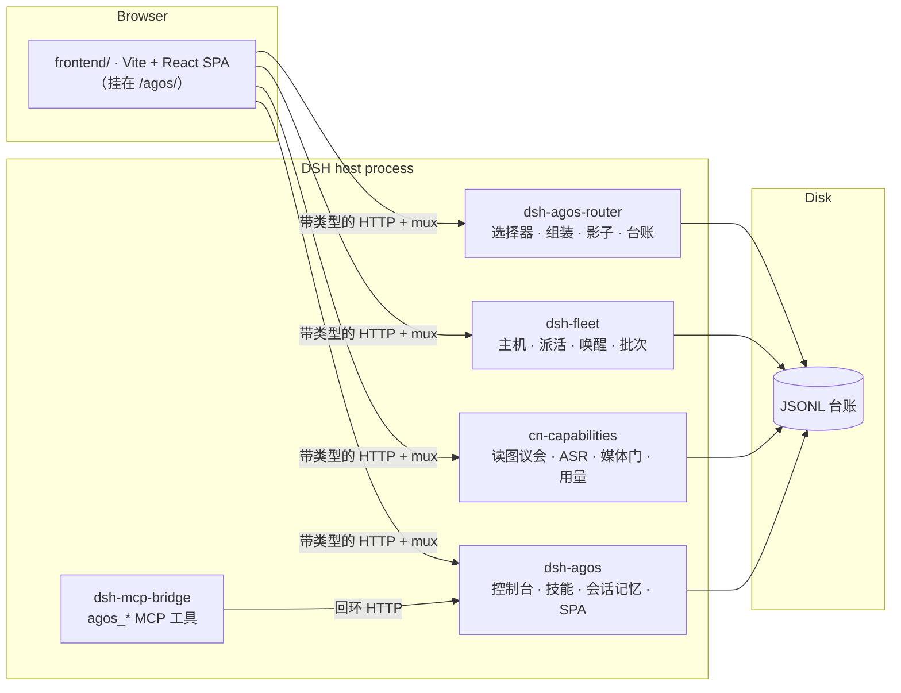

<div align="center">

[](README.md) &nbsp; [](README.zh-CN.md)

</div>

<p align="center">
  
</p>

# AgOS — 跑在 DeepSeek Harness 上的「诚实优先」Agent 操作系统甲板

### 一块遥测甲板、五个宿主插件，和一条硬规矩：屏幕上不许出现数据证明不了的话。

<p align="center">
  
  
  
  
  
  
</p>

> **一个立场**：大多数 agent 仪表盘是乐观主义小说——背后没有探针的绿色徽章、拿三个样本排的排行榜、手打出来的「97% 健康」。AgOS 押相反的注：当 UI **被禁止装饰**的那一刻，Agent 操作系统才开始值得信任。屏上每个数字都从磁盘上的台账推导；缺失的字段渲染成**「未采集」**而不是编造的零；模型给的建议先被记录、再谈信任——先影子、后接线。

2026-09-08 的 Agent 设计就是产品契约：人是执行权威，模型只提案；记忆 / 技能 / 组装共用四段闭环；密钥只有一个分类器；分配只排序。仓内真源是 [`docs/AGENT.md`](docs/AGENT.md)。

---

## 摘要

**AgOS** 是 [DeepSeek Harness](https://github.com/deepseek-ai/deepseek-harness)（DSH）运行时之上的单用户 Agent OS 层。它用一块完整的**遥测甲板**替换原生 Web UI——多模态对话、子代理谱系、homelab 机器编队、模型路由、技能、计划、记忆工作台——背后是五个 DSH 插件，把一切暴露为可审计的 JSONL 台账与带类型的 HTTP 路由。

这个项目把一个问题做到了端到端：**如果「编造」是一种构建错误，agent 驾驶舱会长成什么样？** 答案有四层。

1. **UI** — 仓级 TypeScript AST 扫描器让构建变红：屏上句子不是由它所描述的载荷算出、`/api/agos/routes*` 写端点出现在唯一隔离文件之外、被禁的结论字面量溜回来，任何一条都过不了。
2. **权威** — 活路由 `POST /api/agos/routes/decide` 在宿主上存在，但对 SPA **按构造不可达**。组装、技能短名单、记忆回注都不换本跳会话模型，不自动起 swarm。
3. **闭环** — 记忆、技能、模型分配共用四段：候选 → 排序 → 曝光 → 操作员确认后的反馈。曝光不是胜负。问句缺席不是相关性为零。
4. **带尺的启发式** — 会话记忆抽取器带着标注语料和逐样本回归门。改规则改坏任何一条原本通过的样本就红。

以上没有一条是风格建议。[§2](#2-诚实契约) 的每条规则都点名了执行它的测试。

---

## 目录

- [1. 问题陈述](#1-问题陈述)
- [2. 诚实契约](#2-诚实契约)
- [3. Agent 设计](#3-agent-设计)
- [4. 系统架构](#4-系统架构)
- [5. 十二个面](#5-十二个面)
- [6. HTTP API 参考](#6-http-api-参考)
- [7. 数据层：磁盘上的台账](#7-数据层磁盘上的台账)
- [8. 影子路由](#8-影子路由)
- [9. 会话记忆与「尺」](#9-会话记忆与尺)
- [10. 验证基础设施](#10-验证基础设施)
- [11. 快速开始](#11-快速开始)
- [12. 开发](#12-开发)
- [13. 限制](#13-限制)
- [许可与致谢](#许可与致谢)

---

## 1. 问题陈述

### 1.1 Agent 仪表盘撒谎的三种方式

1. **装饰过的状态。** 状态药丸写「健康」，因为设计师选了绿色，不是因为探针回来了。屏上的句子是字符串常量，它声称在总结的数据从未被咨询。
2. **编造的零。** 采集器没拿到的字段渲染成 `0`、`false` 或空条——与测到的零无法区分。没有证据被静默渲染成「证明没有」。
3. **建议在被测量之前就被服从。** 模型选出「最好的」agent/机器/技能，UI 直接把选择接到执行上。人的反事实选择从未被并排记录，于是永远学不到选择器会错多少。

### 1.2 命题

这三种失败模式都**可被机械检出**，所以都应当是构建错误——靠静态锁和单元门，不靠评审时的警觉。AgOS 是这个命题在真实 agent 运行时上的实现：驱动真实的多机 homelab，每一屏背后都是人可以 `cat` 的只追加台账。

---

## 2. 诚实契约

这些不是风格建议——每一条都有让构建变红的测试。

1. **屏上断言必须从屏上数据算出。** 关于数据集的句子是载荷的函数，不是字符串常量。由派生文案锁与 SSR 内容断言执行（`routes-model.test.ts`、`console-live.test.ts`、`council-ledger-model.test.ts`）。
2. **缺席 ≠ 零 ≠ 假。** 可空遥测字段类型是 `number | undefined`，`undefined` 渲染成「未采集」。概览源带三态头（`ready / stale / absent`）；「没有待办」只允许在*全部*源都是 `ready` 时出现。
3. **路由写端点隔离；decide 禁止。** 变更 `/api/agos/routes*` 的 `fetch` 只许出现在 `routes-assemble.ts`，仓级 AST 锁核对五个字面量 URL，禁止别名、拼接、模板。`/api/agos/routes/decide` 字面量在前端源树里被禁。技能 / 会话记忆 / 记忆甲板的确认写在各自的 `*-api.ts`，**不**加进这条路由白名单。
4. **建议被记录，不被服从。** LLM 路由选择器跑**影子模式**（[§8](#8-影子路由)）：每次派活复核最多一次调用，与人的真实选择并排入账。只有建议的那台机器真正跑了批次，才回填胜负。
5. **启发式带着尺。** 会话记忆抽取器带着标注语料、逐样本通过基线和 `acceptEdit` 门（[§9](#9-会话记忆与尺)）。
6. **安全门按门来测。** 媒体路由把读取限制在 realpath 核对过的附件根，并嗅探魔数。编队产物在拼任何 SSH 命令之前先校验 run ID 与相对路径。密钥只有一个分类器（[§3.3](#33-密一门两类处置)）。

---

## 3. Agent 设计

权威正文：[`docs/AGENT.md`](docs/AGENT.md)。本节是对外转述。

### 3.1 谁有权

操作员是执行权威。模型只提案。`POST /api/agos/routes/decide` 对 SPA 不可达。组装、影子路由、技能短名单、记忆回注都不换本跳会话模型，不自动起 swarm。

### 3.2 四段闭环（记忆 / 技能 / 分配共用）

1. **候选** — 本会话 store / 本跳 catalog / 角色模型池。不发明名单外 id。
2. **排序** — 词面（ASCII≥2，中文整词≥2，子串；丢掉 CJK 单字）+ Beta-Bernoulli 后验（κ=4，未上榜 prior=0.15）。无问句或零重合走重要度候补，必须写**「不是相关性」**。
3. **曝光** — 短名单 K=8。回注 / 目录裁剪 / 组装提案都是曝光，不是胜负。
4. **反馈** — 操作员确认后才写 JSONL。`skill()` 调用、回注曝光、三角色试跑都不是 ok/fail。

禁止 embedding、双塔、协同过滤、假 CTR。禁止把后验接入 live dispatch。

词面短名单若漏掉 constraint，把最高重要度约束保送进名单，`method: 'constraint-reserve'`，lexical=0。

### 3.3 密：一门，两类处置

实现只在 `plugins/dsh-agos/lib/secrets-gate.js`。其它插件只 import，不准再叉一份更弱的正则。

| 处置 | 用在 | 行为 |
|---|---|---|
| **拒绝落盘** | 会话记忆、pin、路由预览 | 整条丢掉并计数，不存片段 |
| **落盘前擦除** | fleet / route-outcome 台账 | 替换为 `«redacted»`，路径与环境名保留 |

### 3.4 分配：只排序

实现只在 `plugins/dsh-agos/lib/allocate-kernel.js`。技能 evolve、记忆短名单、组装 `rankAgents` 共用 prior/后验。三本账本分开：`skill-allocate.jsonl`、`memory-relevance.jsonl`、`route-outcome.jsonl`。影子行不进分配后验。

### 3.5 Prompt：同一套诚实前缀

实现只在 `plugins/dsh-agos/lib/agent-prompts.js`。选择器、技能重排、记忆回注 reminder、组装三角色、编队 guidance、自主优化子代理都从这里组装：只依据给定事实、不编名单外 id、不写 decide、缺席写成未采集。

实现被工具块挡下时去工具再试一次；再失败仍记失败，不编终稿。评审只看实现终稿，看不到规划稿。

### 3.6 明确不做

不训 Conductor / TRINITY。不把组装自动变成 swarm。不发明第一条胜负行。不把桌面 `.app` 当 0.1.2 runtime。AgOS 不写 Fleet Memory / `MEMORY.md`，不跑 `fleet-memory-push.sh`。

---

## 4. 系统架构

### 4.1 总览



两条耦合规矩：

- **插件之间靠文件，不靠运行时互改。** 跨插件数据走磁盘台账。共享核（prompt / 密 / 分配）从 `dsh-agos` import，保证每条规则只有一份。
- **SPA 每次请求从磁盘读。** 改前端 `npm run build` 即可。插件 JS 是拷进 profile 的**副本不是软链**，改完必须 rsync 并重启 dsh。

### 4.2 五个插件

| 插件 | 职责 |
|---|---|
| **`dsh-agos`** | 控制台核心：技能审计/工作室/进化/裁剪、概览、会话元数据、回收站、会话记忆回注与相关账本、记忆甲板、本跳证据、插件清单、SPA 静态服务 |
| **`dsh-agos-router`** | 模型路由：CN 候选上的 LLM 选择器、规则回退、route-outcome JSONL、喂给 planner/implementer/reviewer `assemble()` 的分配后验、确认后的纯文本试跑、影子选择器 |
| **`cn-capabilities`** | 国产模型能力层：**19** 个已注册工具、视觉、语音、生图、委派、带盲仲裁的**读图议会**、`plan_run` 计划库、浏览器/CLI 工具、只读用量 |
| **`dsh-fleet`** | homelab 多机并发：远端 `dsh --profile headless`、进程内本地子代理、显式选择的 Codex SDK 主机、网络唤醒、健康探针、每机并发、改道、产物取回、擦除后的事件台账 |
| **`dsh-mcp-bridge`** | 最小 MCP Streamable HTTP（协议 2025-03-26），五个工具：`agos_sessions`、`agos_prompt`、`agos_result`、`agos_swarm_status`、`agos_memory_search`。只有 `agos_prompt` 会烧模型 |

关键模块：

- **`dsh-agos`** — `lib/agent-prompts.js` · `lib/allocate-kernel.js` · `lib/secrets-gate.js` · `lib/session-memory-rank.js` · `lib/session-memory-inject.js` · `lib/turn-evidence.js` · `lib/memory-desk.js` · `lib/skills-evolve.js`
- **`dsh-agos-router`** — `lib/selector-llm.js` · `lib/allocation-score.js` · `lib/assemble.js` · `lib/dispatch.js` · `lib/shadow.js` · `lib/sanitize.js`
- **`cn-capabilities`** — `lib/index.js` · `lib/council-record.js` · `lib/usage.mjs`
- **`dsh-fleet`** — `lib/fleet-runtime.mjs` · `lib/fleet-ledger.mjs` · `lib/fleet-dispatch.mjs` · `lib/fleet-artifacts.mjs`

### 4.3 仓库布局

```
agos/
├── frontend/               # Vite + React SPA
│   ├── src/pages/
│   ├── src/components/
│   ├── src/contract/       # 钉死的宿主 API 契约
│   ├── src/stores/         # 只许加法
│   └── src/fold/           # 不要改
├── plugins/                # 五个宿主插件
├── docs/AGENT.md           # Agent / prompt / 记忆 / 密 / 分配契约
├── regression/
└── scripts/
```

不要改 `frontend/src/fold`、`frontend/src/api-client`、`frontend/src/contract`、`vite.config.ts`、`package.json`，除非宿主契约本身动了。

### 4.4 钉死的宿主契约

SPA 通过 `frontend/src/contract/api/` 与 DSH 宿主说话，由 `UPSTREAM.pin` 钉在 `deepseek-harness @ a66e470204`（`0.1.2-rc.1`）。`npm run verify` 含 `vendor:diff`，比较的是**该 pin 的 git 对象**（只读 `git show` / `git archive`），不是另一个 checkout 的 live HEAD。线协议常量（`REMOTE_STREAM_MUX_PATH` = `/api/remote.mux` 与 `$events` 端点）必须与 pin 字节相等；膜上 19 个文件通过 `contract-baseline.sha256` 冻结到本轮审查的原始提交内容；这不构成完整类型兼容证明。这些文件是适配集合，不是后来 `packages/host/apiproxy/src/api` 的整树拷贝。不要静默升级 harness，也不要挪 pin。

### 4.5 甲板消费但不随仓发布的源

| 消费源 | 由谁生产 | 用来做什么 |
|---|---|---|
| `/api/remote.mux`（一个路由名；客户端仍为每条逻辑流各开一条 WebSocket）、`/api/$events/result`、会话 RPC | DSH 宿主核心 | 对话流、批准、会话矩阵 |
| `/api/swarm/progress`、`/api/swarm/history` | 外部 swarm 插件 | 谱系树与历史 |
| `/api/trace/sessions` | 外部 trace 插件 | 轨迹时间条 |
| `/api/memory/*` | 外部记忆插件 | 记忆工作台星图 |
| 权限裁决审计 JSONL | 外部 mode-alignment | 对话流工具卡注解 |
| 宿主 civ `memory_submit` | 宿主 tools（可选） | 记忆甲板送 Fleet Memory。未接线 → `CIV_UNAVAILABLE`。光有 `tools.invoke` 不算接线 |
| 本地用量缓存 | 外部菜单栏用量应用 | 供应商额度（只读） |

---

## 5. 十二个面

甲板跑在 `http://127.0.0.1:3091/agos/`。十二个可导航面：三个顶层工作区（对话、记忆、设置）加九个控制台页。

### 5.1 对话流

多模态会话，侧栏分钉选 / 最近 / 归档。批准是一等 UI。权限裁决注解挂在工具卡上。语音走 Web-Audio VAD 与 `POST /api/cn/asr`。删除进审计回收站。`/api/remote.mux` 断了，新建会话按钮禁用并写明原因。屏上 ReplayScrubber 只是对已 fold 快照做切片，不是事件回放。

每一跳可以有**本跳证据条**：只描述这一跳的记忆回注曝光与技能目录裁剪。lane 整段替换，不 deep-merge。没有 pre-step 写成未采集，不编零。证据条不发明第一条「记有用 / 误召回」。

### 5.2 概览遥测

四个台账合成的注意力收件箱。每个源带 `ready / stale / absent`。「没有待办」只在四个源都 `ready` 时出现。

### 5.3 机器与机架

可达性只从 SSH 探针推导；电源快照是意图不是证据。唤醒/休眠有费用确认。派活复核跑影子选择器。

### 5.4–5.7 会话矩阵 / 谱系 / 轨迹 / 计划

缺字段写「未采集」。空态点名缺的台账文件。计划页印「只读数据源」和后端路径。

### 5.8 技能

审计台 + 只提案的工作室。使用率分母未采集就不画百分比。目录裁剪**默认开**，失败回退全量。`skill()` 调用不是胜负。小模型重排是可选（`DSH_AGOS_SKILL_RERANK=1`），到不了就写未采集。

### 5.9 路由决策

每条模型路由决策一行，加上组装 / 试跑。影子行没有手工胜负按钮。试跑是**纯文本三角色**：不换本跳会话，不改仓库；只有评审给出可解析判定且过归因门，才写 `reviewer-verdict`。

### 5.10–5.11 结果行覆盖 / 读图台账

五源七字段，不跨源加总。议会分歧只来自仲裁自己的 `disagreements`。有效回答不足写成不确定，不编共识。

### 5.12 记忆工作台与设置

- 工作集 = 搜索 ∪ 词面重合 ∪ 检视，减去甲板作废 slug。
- 星图钉上同一并集，不把工作集钉标成搜索命中。作废 slug 不钉上星图。
- 相关账本问句锁定本跳回注 query。问句空：「问句未采集，不能记相关」。
- 会话记忆是便利投影，不是 Fleet Memory。甲板晋升/作废写入 `~/.dsh/agos/memory-desk/`，`fleetMemory: false`。送真源必须宿主真有 `memory_submit`，否则 `CIV_UNAVAILABLE`。

设置页是宿主设置命名空间的只读投影，外加插件清单：profile 里没有副本就不说已安装。

---

## 6. HTTP API 参考

48 条 API 路由加两个静态前缀。默认宿主：`127.0.0.1:3091`。

### 6.1 `dsh-agos`

| 方法 | 路径 | 用途 |
|---|---|---|
| GET | `/api/agos/overview` | 汇总 KPI（软依赖，缺源不 500） |
| GET | `/api/agos/session-meta` | 会话元数据 |
| POST | `/api/agos/session-meta/pin` | 钉选 / 取消钉选会话 |
| POST | `/api/agos/session-meta/archive` | 归档 / 取消归档 |
| GET | `/api/agos/session-memory` | 读一会话的抽取记忆 |
| POST | `/api/agos/session-memory/pin` | 钉一条抽取项（需确认；密钥拒绝落盘） |
| GET, POST | `/api/agos/session-memory/inject` | 读/改回注开关（默认开） |
| GET, POST | `/api/agos/session-memory/relevance` | 短名单 + 操作员有用/误召回 |
| GET, POST | `/api/agos/memory/desk` | 晋升 / 作废 / civ 送真源 |
| GET | `/api/agos/turn-evidence` | 本跳记忆/技能证据 |
| GET | `/api/agos/plugins` | profile 插件清单 |
| POST | `/api/agos/session/delete` | 移入审计回收站 |
| GET | `/api/agos/session-trash` | 可恢复清单 |
| GET | `/api/agos/skills` | 技能目录 + 审计 |
| GET | `/api/agos/skills/studio` | 读一条工作室技能 |
| POST | `/api/agos/skills/draft` | 新建技能草稿 |
| POST | `/api/agos/skills/description` | 改描述（需确认） |
| GET, POST | `/api/agos/skills/evolve` | 技能短名单 / 记结果 |
| GET, POST | `/api/agos/skills/trim` | 目录裁剪开关 |
| GET | `/api/agos/yolo-decisions` | 权限裁决台账 |
| GET, HEAD | `/agos` | 从 `frontend/dist` 提供 SPA |

### 6.2 `dsh-agos-router`

| 方法 | 路径 | 用途 |
|---|---|---|
| GET | `/api/agos/routes` | 路由决策台账 |
| POST | `/api/agos/routes/decide` | 活路由——**SPA 按构造不可达** |
| GET | `/api/agos/routes/outcomes` | 五源派生结果行 |
| POST | `/api/agos/routes/outcome` | 手工记一条结果（影子行拒绝） |
| POST | `/api/agos/routes/annotate` | 追加人注 |
| POST | `/api/agos/routes/shadow` | 影子选择器；`pick` 可以为 `null` |
| POST | `/api/agos/routes/shadow/link` | 把影子行绑到真实批次 |
| GET, POST | `/api/agos/routes/assemble` | 读/提组装提案 |
| GET, POST | `/api/agos/routes/assemble/dispatch` | 读/跑确认后的纯文本试跑（提案不一致 409） |

### 6.3–6.5 `cn-capabilities` / `dsh-fleet` / `dsh-mcp-bridge`

与英文 README [§6.3–6.5](README.md#63-cn-capabilities--cn-model-capabilities) 同一张表：议会、计划、用量、媒体门、ASR、视觉；编队 hosts/dispatch/batches/cancel/trace/ws/artifacts/power/wake/sleep/preflight；`POST /mcp` 五个工具。

---

## 7. 数据层：磁盘上的台账

甲板能显示的，都可以 `cat`。写入前擦除或拒绝密钥。

| 文件 | 谁写 | 用途 |
|---|---|---|
| `~/.dsh/logs/route-outcome.jsonl` | `dsh-agos-router` | 决策、结果、注解、影子、组装/试跑 |
| `~/.dsh/logs/fleet/runs.jsonl` | `dsh-fleet` | 编队生命周期 + 电源事件 |
| `~/.dsh/logs/council-record.jsonl` | `cn-capabilities` | 读图议会 |
| `~/.dsh/logs/plans/plan-*.json` | `cn-capabilities` | 一条计划一份 JSON |
| `~/.dsh/agos/skill-allocate.jsonl` | `dsh-agos` | 操作员确认后的技能有用/无用 |
| `~/.dsh/agos/memory-relevance.jsonl` | `dsh-agos` | 操作员有用/误召回 |
| `~/.dsh/agos/turn-evidence.jsonl` | `dsh-agos` | 每会话最后一次 pre-step 证据 |
| `~/.dsh/agos/session-memory/*.json` | `dsh-agos` | 每会话抽取记忆（`0600`） |
| `~/.dsh/agos/session-memory-inject.json` | `dsh-agos` | 回注开关（默认开） |
| `~/.dsh/agos/memory-desk/*.jsonl` | `dsh-agos` | 晋升 / 作废 / civ。不是 Fleet Memory |
| `~/.dsh/agos/delete.log` | `dsh-agos` | 会话删除审计 |

试跑行不是决策，也不是胜负。会话记忆读失败写成「店未读」，不写成空店。抽取失败标 `degraded`，显示上次确认内容。

---

## 8. 影子路由

路由选择器故意没有权力。复核编队派活时，AgOS 问小模型「你会挑哪台」——然后除了写下来什么都不做。

1. **复核** — 打开派活确认步，最多一次 `POST /api/agos/routes/shadow`。人的勾选不进选择器输入。
2. **入账** — `mode:'shadow'`。模型失败时 `pick` 为 `null`，不编第一台候选。
3. **关联** — 真的派了，才写 `ev:'shadow-link'`。
4. **回填** — 只有建议的那台机器真正跑了批次。

影子行不进分配后验。影子行上的手工胜负被后端拒绝。

---

## 9. 会话记忆与「尺」

`dsh-agos` 从会话转录抽取用户亲口说的事实、约束、偏好和否决。

### 9.1 抽取门

只收浏览器/RPC 通道上的直接用户文本。问句、表格、代码围栏、碎片对所有 kind 一票否决。单跳工具指令不能变成持久约束。密钥模式整条丢掉并计数。

### 9.2 店上的推荐闭环

回注（默认开）把 fail-closed 短名单 prepend 进下一跳。reminder 写明这是便利投影，不是 Fleet Memory。曝光记在本跳证据 lane。有用/误召回只在操作员按锁定的回注问句确认后才写。

### 9.3 标注语料与 `acceptEdit`

四块分开计分。known-misreports 是作者没对着调过的唯一块，目前 8 条里仍有 3 条失败，基线不静默改。语料由本地 `mine.mjs` 从你自己的会话档案生成，不随仓分发。任何一条原本通过的样本回归，套件就红。

---

## 10. 验证基础设施

### 10.1 测试矩阵

2026-09-08 对本树清点。零模型调用。

| 包 | 通过 / 失败 / 跳过 | 验证范围 |
|---|---:|---|
| `frontend/` | 365 / 0 / 1 | `npm run verify`：版本、类型、测试、构建、pin 与适配文件内容检查 |
| `plugins/dsh-agos` | 154 / 0 / 2 | `node --test test/*.mjs`，包含 3 项性能检查 |
| `plugins/dsh-agos-router` | 91 / 0 / 0 | HTTP、反馈与影子关联 |
| `plugins/dsh-fleet` | 137 / 0 / 0 | 完整套件、真实多进程锁、清理生命周期 |
| `plugins/cn-capabilities` | 82 / 0 / 0 | 计划、隔离验证与真实 macOS 沙箱 |
| `plugins/dsh-mcp-bridge` | 4 / 0 / 0 | fake MCP |
| **合计** | **833 / 0 / 3** | 三项私有语料检查明确跳过；另有 6 项浏览器组件交互检查 |

静态锁与浏览器回归见英文 README [§10.2–10.3](README.md#102-static-locks)。本轮真实 Chrome 组件夹具 6/6 通过；未运行真实宿主端到端回归。完整命令、日志和限制见 [最终验收](docs/engineering/agos-hardening-20260908/VERIFICATION.md)。部署 dry-run 因尚未部署而报告漂移。

---

## 11. 快速开始

### 11.1 要求

- DSH 宿主：DSH Desktop 或 `@deepseek-ai/dsh` **0.1.2-rc.1**（不要静默升级）
- Node ≥ 22
- 一个 DSH profile 目录（`~/.dsh/profiles/<name>/`）

### 11.2 安装与部署

```bash
git clone https://github.com/LeoLin990405/agos && cd agos

cd frontend && npm install && npm run build && cd ..
scripts/deploy-plugins.sh
```

插件部署是**副本不是软链**。宿主从每个插件文件的 realpath 解析 `@deepseek-ai/*`，所以插件必须物理住在 profile 树里。

### 11.3 注册插件

在 profile 的 `package.json` 里加 `file:` 依赖，并在 `cordis.patch.yml` 里登记 `agos`、`agos-router`、`cn-capabilities`、`fleet`、`mcp-bridge`。

然后跑 web 宿主：

```bash
dsh --profile web --port 3091 --no-open
# → http://127.0.0.1:3091/agos/
```

本机桌面重启只用 `nohup /bin/zsh ~/bin/dsh-desktop &`。不要把桌面 `.app` 当 0.1.2 runtime。

### 11.4 日常迭代

```bash
scripts/iterate.sh            # 构建 → 部署 → 插件字节变了才重启
scripts/iterate.sh --test     # 先过全闸
```

只改前端：`frontend/` 里 `npm run build`。改插件 JS：rsync profile 副本并重启 dsh。

---

## 12. 开发

```bash
scripts/dev-links.sh   # 一次：给仓内插件测试用的 gitignore 软链
scripts/test-all.sh    # 前端 verify + 五个插件套件 + 部署漂移
```

`test-all.sh` 零模型调用，并保留 `npm run verify` 与各插件 `node --test` 的真实退出码（grep 只过滤显示）。私有语料检查仅在显式设置 `SESSION_MEMORY_CORPUS_DIR` 时读取，本轮明确跳过；`mine.mjs` 也要求显式路径。`npm run replay` 需要 `AGOS_CORPUS`（历史上默认 392 条回收站会话）。语料不在是环境不满足，不是通过；不要把往年的「392 会话通过」抄成本次结果。仓内没有跟踪 `.github/workflows`。

插件必须拷贝部署的原因、以及 `iterate.sh` / `deploy-plugins.sh` / `dev-links.sh` / `test-all.sh` 的行为，见英文 README [§12](README.md#12-development)。

---

## 13. 限制

照着这件事的精神，直接说：

1. **单用户、本机优先。** 自己没有鉴权层。不要把 3091 暴露到你不信任的网上。
2. **记忆工作台星图依赖外部插件。** 没有 `/api/memory/*` 时记忆面渲染安静的缺席态。会话记忆抽取/回注仍由 `dsh-agos` 自己工作。
3. **Fleet Memory 送真源 fail-closed。** 不假设宿主 civ `memory_submit` 在场。光有 `tools.invoke` 不算接线。工具没注册之前，甲板保持 `CIV_UNAVAILABLE`，`fleetMemory: false`。
4. **尺量的是拟合，不是泛化。** known-misreports 8 条里仍有 3 条失败，基线不静默改。
5. **影子证据长得慢。** 没有合成回放。不为了让图好看而发明第一条技能或记忆胜负行。
6. **分配不派活。** 后验只给组装提案和短名单排序，不挑本跳会话模型。
7. **台账规模是 homelab 规模。** 读时 fold JSONL 对几千行快，对几百万行不快。
8. **国产模型工具按国产供应商来。** 换供应商要改 `cn-capabilities`。
9. **Fleet 生命周期验证。** 本轮修复了已观察到的测后 ledger rename 竞态，并通过完整 137 项 Fleet 测试；真实部署派活仍未纳入本轮验收。

---

## 许可与致谢

- [MIT](LICENSE)。
- `frontend/src/contract/` 下的 API 契约是对准 [deepseek-harness](https://github.com/deepseek-ai/deepseek-harness)（MIT, © DeepSeek）pin `a66e470204` 的 AgOS 膜。`npm run vendor:diff` 核的是该 pin 对象，不是任意 checkout 的 HEAD。
- 跑在 DeepSeek Harness 插件运行时（`cordis`）上；宿主包（`@deepseek-ai/*`）由你的 DSH 安装提供。
- 浏览器回归经 [OpenCLI](https://github.com/jackwener/opencli) 的浏览器桥驱动。
- 本树发布为 [`LeoLin990405/agos`](https://github.com/LeoLin990405/agos)。
