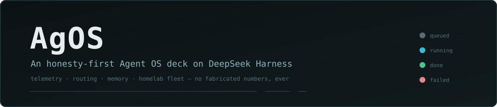

<div align="center">

[](README.md) &nbsp; [](README.zh-CN.md)

</div>

<p align="center">
  
</p>

# AgOS — 跑在 DeepSeek Harness 上的「诚实优先」Agent 操作系统甲板

### 一块遥测甲板、五个宿主插件,和一条硬规矩:屏幕上不许出现数据证明不了的话。

<p align="center">
  
  
  
  
  
  
</p>

> **一个立场**:大多数 agent 仪表盘是乐观主义小说——背后没有探针的绿色徽章、拿三个样本排的排行榜、手打出来的「97% 健康」。AgOS 押相反的注:当 UI **被禁止装饰**的那一刻,Agent 操作系统才开始值得信任。屏上每个数字都从磁盘上的台账推导;缺失的字段渲染成**「未采集」**而不是编造的零;模型给的建议先被记录、再谈信任——先影子、后接线。

---

## 摘要

**AgOS** 是 [DeepSeek Harness](https://github.com/deepseek-ai/deepseek-harness)(DSH)运行时之上的单用户 Agent OS 层。它用一块完整的**遥测甲板**替换原生 Web UI——多模态对话、子代理谱系、homelab 机器编队、模型路由、技能、计划、记忆工作台——背后是五个 DSH 插件,把一切暴露为可审计的 JSONL 台账与带类型的 HTTP 路由。

这个项目把一个问题做到了端到端:**如果「编造」是一种构建错误,agent 驾驶舱会长成什么样?** 这里给出的答案有三层。在 UI 层,仓级 TypeScript AST 扫描器让构建变红:屏上句子不是由它所描述的载荷算出、写端点出现在唯一隔离文件之外、被禁的结论字面量溜回来,任何一条都过不了。在决策层,LLM 路由选择器跑**影子模式**——它的建议连同人的真实选择一起写进台账,只有编队终态才有资格给它记分。在启发式规则层,会话记忆抽取器带着标注语料和逐样本回归门:改规则改坏任何一条原本通过的样本就红,接受新基线是一次显式的、署名的动作。

以上没有一条是风格建议。[§2](#2-诚实契约) 的每条规则都点名了执行它的测试。

---

## 目录

- [1. 问题陈述](#1-问题陈述)
- [2. 诚实契约](#2-诚实契约)
- [3. 系统架构](#3-系统架构)
- [4. 十二个面](#4-十二个面)
- [5. HTTP API 参考](#5-http-api-参考)
- [6. 数据层:磁盘上的台账](#6-数据层磁盘上的台账)
- [7. 影子路由](#7-影子路由)
- [8. 会话记忆与「尺」](#8-会话记忆与尺)
- [9. 验证基础设施](#9-验证基础设施)
- [10. 快速开始](#10-快速开始)
- [11. 开发](#11-开发)
- [12. 局限](#12-局限)
- [许可与致谢](#许可与致谢)

---

## 1. 问题陈述

### 1.1 Agent 仪表盘说谎的三种方式

1. **装饰出来的状态。** 状态灯是绿的,因为设计师选了绿色,不是因为探针返回了。屏上那句话是字符串常量;它声称在总结的数据从来没被读过。
2. **编造的零。** 采集器从未捕获的字段渲染成 `0`、`false` 或一根空条——和真实测得的零无法区分。「没有证据」被悄悄渲染成了「证明没有」。
3. **先服从、后测量的建议。** 模型挑出「最优」的 agent/机器/技能,UI 直接把这个选择接进执行链。没有人知道选择器错得有多频繁,因为人的反事实选择从来没被并排记录过。

### 1.2 命题

这三种失败模式都是**机械可检测的**,所以三种都应该是构建错误——由静态锁和单测门执行,而不是靠 review 时的警觉。AgOS 是这个命题在真实 agent 运行时之上的可运行实现:驱动一套真实的多机 homelab,每块屏幕背后都是一份人能 `cat` 的只追加台账。

---

## 2. 诚实契约

这些不是风格建议——每一条都有让构建变红的测试:

1. **屏上断言必须由同屏数据算出。** 谈论一批数据的句子是载荷的函数,不是字符串常量。由「派生文案锁」执行:测试读取相邻组件源码,断言被禁的结论字面量不存在(`routes-model.test.ts`、`console-live.test.ts`、`council-ledger-model.test.ts`);另有 SSR 内容断言,用受控载荷渲染组件并检查产出的文案。
2. **缺席 ≠ 零 ≠ 假。** 每个可空遥测字段类型是 `number | undefined`,`undefined` 渲染成「未采集」——带专属文案的一等 UI 状态。概览各来源带三态头(`ready / stale / absent`);「无待处理」这句空态,只有四个来源全部 `ready` 时才允许渲染。
3. **写端点隔离。** 所有写 `fetch` 集中在唯一一个文件(`routes-assemble.ts`),由仓级 AST 锁把守:URL 只许字面量、对照 5 条白名单、禁别名、禁拼接、禁模板组装,配套断言检查 fetch 调用点的字面量恰好覆盖白名单一次。模型路由的 `decide` 端点在后端存在,但**从构造上就无法从 UI 到达**——那个字符串字面量本身在前端源码树全域被禁。
4. **建议被记录,不被服从。** LLM 路由选择器跑**影子模式**([§7](#7-影子路由)):每次派发检查至多一次调用,连同人的真实选择一起写进台账——一致性是被测量的,不是被假设的。只有建议的机器真的跑了批次,终态才回填到建议头上;跑在别的机器上的批次永远不给建议记分,影子行上的手工胜负写入会被后端以带类型错误拒绝。
5. **启发式规则带尺。** 会话记忆抽取器带着标注语料、逐样本通过基线和 `acceptEdit` 门([§8](#8-会话记忆与尺)):任何原本通过的样本回归即红——提升不能抵消回归,接受新基线需要显式环境变量加一段书面规则说明。
6. **安全闸按闸测试。** 媒体路由把读取限制在 realpath 校验过的附件根内,对内容寻址文件做魔数嗅探,调用方声称的 MIME 只是「待核实的期望」——穿越、软链、双扩展、伪造类型各有专门单测。编队 artifact 取回在拼任何 SSH 命令之前先校验 runId 与相对路径。

---

## 3. 系统架构

### 3.1 总览


两条刻意的耦合规则塑造了这个设计:

- **插件之间走文件,不走 import。** 跨插件数据经磁盘上的共享台账流动。例如 `dsh-agos-router` 派生编队结果行时**裸读**编队运行台账——刻意绕开 fleet 插件的 `FleetLedger` 类,保证一次读取永远不会触发它的自动压缩重写。
- **SPA 按请求从磁盘读。** `dsh-agos` 每个请求都从 `frontend/dist` 读文件并做 SPA 回退,所以改前端永远不需要重启宿主。

### 3.2 五个插件

| 插件 | 职责 |
|---|---|
| **`dsh-agos`** | 控制台核心:OS 级控制面板(侧栏入口 + 全帧浮层,零 shell patch)、技能审计/工作室/进化、概览聚合、会话元数据(置顶/归档)、带锁可审计可回滚的会话回收站、会话记忆存储、权限审计只读服务,以及 SPA 静态服务。 |
| **`dsh-agos-router`** | 模型路由:CN 候选模型上的 LLM 选择器、规则回落、route-outcome JSONL 台账、探索感知的分配后验(喂给 planner/implementer/reviewer 的 `assemble()` 流程)、确认门控的纯文本派发测试,以及影子模式选择器。 |
| **`cn-capabilities`** | CN 模型能力层:视觉工具(`see_image`、`see_video`、`read_screenshot_text`、`diagnose_screenshot`、`read_diagram`、`read_chart`、`ui_to_code`、`ui_diff`)、语音(`speak`、ASR 路由)、生图、委派(`delegate_task`)、带盲仲裁的多模型**议会**、`plan_run` 计划存储、浏览器/CLI 工具、只读额度计量。 |
| **`dsh-fleet`** | homelab 多机并发:把自包含子任务派到远端 `dsh --profile headless` worker(ssh+stdin)、本机进程内子代理,或显式 opt-in 的本地 Codex SDK host——带网络唤醒、健康探测(60s SSH 复用)、单机并发上限、改派、artifact 取回和脱敏事件台账。 |
| **`dsh-mcp-bridge`** | 把本机控制面暴露为最小 MCP Streamable HTTP 服务(协议 2025-03-26,`POST /mcp`),五个工具:`agos_sessions` · `agos_prompt` · `agos_result` · `agos_swarm_status` · `agos_memory_search`。五个里四个只读;只有 `agos_prompt` 会启动真实模型工作。 |

各插件关键模块:

- **`dsh-agos`** — `lib/index.js`(路由、技能图书馆员审计 + 5 分钟缓存、带删除锁与投影缓存清理/回滚的会话管理器)· `lib/skills-console.js`(多根扫描、`servedToModel` 标注、跨根遮蔽分析、索引 token 预算估算)· `lib/skills-studio.js`(确认门控的草稿与描述修改)· `lib/skills-evolve.js`(胜负台账、词法候选 + 经验后验、可选小模型重排带回落)· `lib/session-memory.mjs` · `lib/session-trash.mjs` · `lib/yolo-decisions.mjs`。
- **`dsh-agos-router`** — `lib/selector-llm.js`(系统提示组装、输出解析)· `lib/selector.js` / `lib/fallback.js` · `lib/ledger.js`(追加/折叠)· `lib/allocation-score.js`(探索感知排序)· `lib/assemble.js` / `lib/dispatch.js` · `lib/shadow.js` · `lib/sanitize.js`(请求体里的「verified」标签永不被信任)。
- **`cn-capabilities`** — `lib/index.js`(工具 + ASR/媒体路由)· `lib/council-record.js`(记录形状;分歧永不折叠)· `lib/usage.mjs`(只读 SQLite + 历史文件读取本机额度缓存)。
- **`dsh-fleet`** — `lib/fleet-runtime.mjs`(运行生命周期与结算)· `lib/fleet-ledger.mjs`(带密钥脱敏的事件台账)· `lib/fleet-dispatch.mjs`(HTTP 派发)· `lib/fleet-artifacts.mjs`(安全路径 artifact 流式取回)· `lib/fleet-power.mjs`(唤醒预算/轮询、休眠门控)· `lib/fleet-codex.mjs`(opt-in Codex SDK host)。

### 3.3 仓库结构

```
agos/
├── frontend/               # Vite + React SPA(TypeScript,node:test via tsx)
│   ├── src/pages/          # ChatPage · ConsolePage · MemoryGraphPage · SettingsPage
│   ├── src/components/     # chat/ console/ fleet/ graph/ lineage/ layout/ ui/
│   ├── src/contract/       # vendored DSH 宿主 API 契约(钉版)
│   ├── src/stores/         # mux 客户端、实时会话 store
│   ├── src/fold/           # 转录折叠引擎 + 回放不变量
│   └── UPSTREAM.pin        # 钉住的上游契约版本
├── plugins/
│   ├── dsh-agos/           # 控制台核心 + SPA 服务
│   ├── dsh-agos-router/    # 路由、台账、影子选择器
│   ├── cn-capabilities/    # 视觉 / 语音 / 议会 / 计划 / 额度
│   ├── dsh-fleet/          # homelab 编队派发
│   └── dsh-mcp-bridge/     # MCP Streamable HTTP 桥
├── regression/             # OpenCLI 浏览器回归 + macOS 壳(Swift)
├── scripts/                # iterate.sh · deploy-plugins.sh · dev-links.sh · test-all.sh
└── docs/media/             # banner 与静态资源
```

### 3.4 Vendored 宿主契约

SPA 通过 vendored 在 `frontend/src/contract/api/` 的带类型 API 契约与 DSH 宿主对话,`UPSTREAM.pin` 钉住版本。`npm run verify` 包含 `vendor:diff`——对 vendored 副本与已安装 harness 契约目录做递归 diff,任何输出即漂移即失败。`upgrade:dsh` 一步完成重新 vendor 与重钉。这把「宿主在我们脚下更新了」从运行时惊吓变成一行红色 CI。

### 3.5 甲板消费但不随仓分发的东西

AgOS 读取若干由宿主安装或本仓之外的伴生插件产生的数据源。甲板把它们全部当作可选:缺席的来源渲染成 `absent`/「未采集」,永远不是报错页,更不是编造的零。

| 消费的数据源 | 由谁产生 | 用于 |
|---|---|---|
| `/api/events.mux`、`/api/respond`、会话 RPC | DSH 宿主核心 | 对话转录、审批、会话矩阵 |
| `/api/swarm/progress`、`/api/swarm/history` | swarm 插件(外部) | 谱系树与历史 |
| `/api/trace/sessions` | trace 插件(外部) | 轨迹时间占比条 |
| `/api/memory/*`(graph、search、link-suggestions) | 记忆插件(外部) | 记忆工作台图谱 |
| 权限裁决审计 JSONL | 模式对齐组件(外部) | 对话里的裁决注解、审计路由 |
| 本机额度缓存(SQLite + 历史 JSON) | 菜单栏额度应用(外部) | 供应商额度表(严格只读,不发起任何在线探测) |

---

## 4. 十二个面

甲板跑在 `http://127.0.0.1:3091/agos/`。十二个可导航的面:三个顶层工作区(对话、记忆、设置)加九个控制台标签页。每个面与真实数据源 1:1 对应——没有任何一页背后没有数据源。

### 4.1 对话流

多模态对话,带会话侧栏(置顶 / 最近 / 归档,标题、目录与对话内容全文搜索)。

- **审批是一等 UI**:审批面板渲染允许/拒绝;「总是允许」只在宿主契约真能兑现时才出现。远端转录渲染为只读。
- **权限裁决注解**:裁决审计里的判决贴到对应工具卡上;没有理由的渲染成「裁判未留理由」,而不是编一个。
- **语音输入**:Web-Audio VAD 电平计量,经 `POST /api/cn/asr` 转写;逐片段语音留痕跟随进提交的消息。
- **读图仲裁卡**:三个隔离的视觉后端独立作答;第四个**盲**仲裁比对三者,逐评委标注疑似编造。
- **回收站而非删除**:删除把会话移入带审计的回收站根,前置确认弹窗;回收站面板列出可恢复会话。
- **连接诚实**:实时事件流断开时,新建会话按钮禁用并显式提示「events.mux 未连接」,而不是静默失败。

*后端:宿主 mux + `dsh-agos` + `cn-capabilities`。*

### 4.2 概览遥测

四个台账汇合的注意力收件箱——谱系失败、待回填路由、技能漂移、被标记评审——外加会话矩阵与额度带。

- 每个来源带三态头:`ready` / `stale`(刷新失败,沿用旧数据)/ `absent`(未采集)。
- 「无待处理」这句空态只有四个来源全 `ready` 才许渲染;缺席的来源会被点名,而不是被略过。
- 附注由数据派生——例如议会读取恰好返回服务端窗口大小时,会标注「可能被截断」。
- 导航灯与计数只在概览来源 `ready` 时渲染。

*后端:`/api/agos/overview` + swarm progress + 路由台账 + 议会台账。*

### 4.3 机器与机架

homelab 编队:机器卡片带可达性、电源状态、在途运行与批量派发。

- 机器的视觉状态(`可达 / 不可达 / 唤醒中`)只从 SSH 探测事实派生;电源快照被当作**意图**,永远不当证据。
- 唤醒和休眠动作前置显式成本确认。
- 运行状态词汇表有九个状态,包括「已断连,等待重贴」和「工作区丢失」——多数仪表盘会把它们折叠成一个「失败」。
- 派发弹窗在检查步跑**影子选择器**([§7](#7-影子路由));8 秒卡死保护让 SSH 探测不会把 UI 钉死在加载态。

*后端:`dsh-fleet` + `dsh-agos-router` 的影子端点。*

### 4.4 会话矩阵

所有宿主会话的实时矩阵,带运行/排队/完成灯与跳转对话。

- 预设标签与描述符标签语义分离——只在缺席时回落,永不拼接;三种「缺标签」情形各自有区分的渲染。
- 头尾截断(12+10 字符)保证同批子代理靠 `#k (角色)` 后缀仍可区分。

*后端:宿主会话 RPC + `dsh-agos` 会话元数据。*

### 4.5 智能体谱系

子代理家谱:实时批次的作业树 + 按天的历史视图。

- 作业灯五态;时长格式化对非有限值渲染「未采集」。
- 空态直接点名缺失的台账文件路径,而不是一块泛泛的空白。
- 数据来源行(实时 progress 还是历史文件)直接印在屏上。

*后端:swarm progress + swarm history 台账。*

### 4.6 轨迹时间流

按会话的时间分解:每会话一根 LLM 与工具时长的堆叠条,带轮次与步数,15 秒轮询(轮询间隔印在屏上)。

- 归档会话不给「接入」按钮——经会话元数据把关,点击永远不会弹跳进另一个会话;元数据不可用时降级为**显示**按钮,而不是把真实会话藏起来。

*后端:trace 时间线路由 + `dsh-agos` 会话元数据。*

### 4.7 计划与目标

计划记录的只读档案,状态派生(`已执行 / 已批准 / 已编辑 / 待处理`)。

- 「只读数据源」四个字和后端端点直接印在页面上;错误态点名失败的端点与 HTTP 状态码。
- 计划总数与概览总数交叉核对——但只在概览数据新鲜时进行。

*后端:`cn-capabilities` 计划存储 + 概览交叉核对。*

### 4.8 技能注册表 + 工作室

技能注册表审计与一个只会「提案」的工作室。

- 按根徽章区分**模型在用**根与控制台专用根;跨根遮蔽与内容漂移进入分级审计发现。
- 使用率百分比在分母 `ready` 之前拒绝渲染;用量消失与从未使用的技能被摆上台面,不被藏起。
- 工作室起草技能(名称归一、目录冲突检查、触发词评测用例),且只会**提案**——每次写入都有确认门。
- 冻结的方法论文案常量把认识论直接印在屏上:调用次数不是裁决;模型重排是 opt-in,小模型不可达时显示明确的「不可用」状态。

*后端:`dsh-agos` 技能路由 + 宿主 RPC 技能列表。*

### 4.9 路由决策

每次模型路由决策一行台账:pick、置信、理由、来源、结果回填——外加组装/派发工作流。

- 缺席字段渲染「未采集」——pick、角色、任务类型、候选、置信全都有显式的未采集态。
- 影子行用专属文案,且**没有**手工胜负按钮;它的胜负只能来自编队终态回填(后端对手工写入返回带类型错误)。
- 普通待回填行的手工记录前置确认勾选;组装与派发各有独立确认步,派发不匹配返回带类型的 `409`。
- 这个视图本身不含任何网络原语——AST 锁证明它只能经唯一批准的数据钩子读取。

*后端:`dsh-agos-router` 台账路由。*

### 4.10 结果行覆盖

五家异构台账(route / council / plan / civ / fleet)归一成七字段结果行和一张 `(来源, 任务类型, 模型)` 覆盖网格——渲染在路由标签页下半部。

- 网格**拒绝语义合并**:各来源的任务类型词表各自独立,永不跨来源求和,这个拒绝本身写在屏上。
- 诚实注解印在数据要求的地方:议会行的任务类型是「未采集」,因为记录的 `kind` 字段是写入管线的判别符、不是任务类型;被仲裁标记的行计为失败;计划的「成功」只代表子代理跑完了。
- 覆盖摘要句由网格载荷算出——有测试证明它不是常量。

*后端:`dsh-agos-router` 的结果派生器。*

### 4.11 读图台账

多模型读图评审轮次的档案,带仲裁判决。

- 分歧高亮只渲染仲裁自己给出的 `disagreements` 数组——永不由客户端逐行 diff 重构(派生文案锁保证被删掉的 diff 助手不会回来)。
- 早于某字段的旧记录渲染「未采集(本条记录早于该字段)」。
- 有效答案不足的轮次显示明确的「未产出仲裁」横幅,而不是合成一个共识。
- 图片经魔数嗅探的媒体闸流式取出。

*后端:`cn-capabilities` 议会记录 + 媒体路由。*

### 4.12 记忆工作台与设置

**记忆** — 情节/语义/技能记忆的 wikilink 画布图谱,四种视图(星图 / 自我邻域 / 个性化 PageRank 社区 / supersedes 链谱系),防抖搜索带命中扩展,补链建议带「建议已被采纳」检测,节点检查器与会话记忆面板。失败态安静、点名 HTTP 状态、给重试按钮。*(由外部记忆插件提供后端,见 [§3.5](#35-甲板消费但不随仓分发的东西)。)*

**设置** — 宿主设置命名空间的严格只读投影:每行来源芯片(用户 / base / 默认 / 受保护),受保护值只渲染「已配置/未配置」,「重启生效」与「即时生效」芯片,以及一个请**宿主**打开自己设置文档的按钮——UI 内不做任何编辑。

---

## 5. HTTP API 参考

五个插件共注册 41 条 API 路由加两个静态前缀,全部挂在 DSH 宿主 web 服务上(默认部署:`127.0.0.1:3091`)。

### 5.1 `dsh-agos` — 控制台核心

| 方法 | 路径 | 用途 |
|---|---|---|
| GET | `/api/agos/overview` | 聚合 KPI:会话、计划、技能、谱系计数(软依赖——缺一个来源不 500) |
| GET | `/api/agos/session-meta` | 会话元数据列表(置顶/归档态) |
| POST | `/api/agos/session-meta/pin` | 置顶 / 取消置顶 |
| POST | `/api/agos/session-meta/archive` | 归档 / 取消归档 |
| GET | `/api/agos/session-memory` | 读取单会话的抽取记忆 |
| POST | `/api/agos/session/delete` | 把会话移入带审计的回收站 |
| GET | `/api/agos/session-trash` | 可恢复的已删会话列表(只读) |
| GET | `/api/agos/skills` | 技能目录 + 审计载荷(`?refresh=1` 重扫) |
| GET | `/api/agos/skills/studio` | 读单个技能供工作室编辑 |
| POST | `/api/agos/skills/draft` | 在磁盘上创建技能草稿 |
| POST | `/api/agos/skills/description` | 修改技能描述(确认门控) |
| GET, POST | `/api/agos/skills/evolve` | 提案技能进化候选 / 记录胜负 |
| GET | `/api/agos/yolo-decisions` | 权限裁决审计行(只读,按会话白名单) |
| GET, HEAD | `/agos` *(静态前缀)* | 从 `frontend/dist` 服务 SPA,带 SPA 回退 |

### 5.2 `dsh-agos-router` — 路由与台账

| 方法 | 路径 | 用途 |
|---|---|---|
| GET | `/api/agos/routes` | 最近的路由决策台账 |
| POST | `/api/agos/routes/decide` | 实时路由决策——**从构造上无法从 UI 到达** |
| GET | `/api/agos/routes/outcomes` | 跨五家台账派生的结果行(`?kind=` 过滤) |
| POST | `/api/agos/routes/outcome` | 记录一条手工结果(影子行被拒) |
| POST | `/api/agos/routes/annotate` | 给决策追加人工批注 |
| POST | `/api/agos/routes/shadow` | 影子选择器——一次 POST 至多一次模型调用;`pick` 可为 `null` |
| POST | `/api/agos/routes/shadow/link` | 把影子记录关联到实际跑的编队批次 |
| GET, POST | `/api/agos/routes/assemble` | 读最新组装态 / 提案一个团队 |
| GET, POST | `/api/agos/routes/assemble/dispatch` | 读派发态 / 跑确认门控的纯文本派发(不匹配返回 `409`) |

### 5.3 `cn-capabilities` — CN 模型能力

| 方法 | 路径 | 用途 |
|---|---|---|
| GET | `/api/cn/council-records` | 结构化议会/评审台账 |
| GET, POST | `/api/cn/plans` *(前缀)* | 列出已存计划 / 编辑计划的目标与步骤 |
| GET | `/api/usage/providers` | 本机额度缓存里的供应商配额(只读,不在线探测) |
| GET, HEAD | `/api/cn/media` | 媒体闸:沙箱化、魔数嗅探的 artifact 流式服务,支持 Range |
| POST | `/api/cn/asr` | 语音转文字(base64 音频,25 MB 上限,服务端转码) |
| POST | `/api/cn/vision` | 视觉问答(base64 图片,12 MB 上限) |

### 5.4 `dsh-fleet` — homelab 编队

| 方法 | 路径 | 用途 |
|---|---|---|
| GET | `/api/fleet/hosts` | 全部机器:健康、在途运行、当前任务、电源状态 |
| POST | `/api/fleet/dispatch` | 把 prompt 派发到选中机器成批(`202` 带 runs) |
| GET | `/api/fleet/batches` | 批次列表(`?include=runs`) |
| GET | `/api/fleet/batch` | 单批次详情 |
| POST | `/api/fleet/cancel` | 取消批次或单个 run |
| GET | `/api/fleet/trace` | 按物理行号增量读取 run 的实时 trace |
| GET | `/api/fleet/ws` | 浏览远端 worker 工作区 / 读单个文件 |
| GET | `/api/fleet/artifacts` | run 的 artifact 清单 |
| GET | `/fleet/artifact/…` *(静态前缀)* | 经 SSH 流式取回单个 artifact 或 tgz |
| GET | `/api/fleet/power` | 全部远端节点电源状态 |
| POST | `/api/fleet/wake` | 唤醒指定机器(`202` 带逐机电源状态) |
| POST | `/api/fleet/sleep` | 让一台机器休眠(需 `confirm`) |
| POST | `/api/fleet/preflight` | 可达性探测 + 冒烟检查 |

### 5.5 `dsh-mcp-bridge` — MCP

| 方法 | 路径 | 用途 |
|---|---|---|
| POST | `/mcp` | JSON-RPC MCP 端点(Streamable HTTP,1 MiB 体积上限):`agos_sessions` · `agos_prompt` · `agos_result` · `agos_swarm_status` · `agos_memory_search` |

---

## 6. 数据层:磁盘上的台账

甲板显示的一切都能 `cat`。台账除注明外都是只追加 JSONL;写入方在追加前先做密钥脱敏。

| 文件 | 写入方 | 用途 |
|---|---|---|
| `~/.dsh/logs/route-outcome.jsonl` | `dsh-agos-router` | 路由决策、结果、批注、影子建议、组装/派发试验 |
| `~/.dsh/logs/fleet/runs.jsonl` | `dsh-fleet` | 编队运行全生命周期 + 机器电源事件(脱敏、自动压缩、14 天保留) |
| `~/.dsh/logs/council-record.jsonl` | `cn-capabilities` | 多模型议会轮次,带仲裁判决与逐评委统计 |
| `~/.dsh/logs/plans/plan-*.json` | `cn-capabilities` | 一计划一 JSON:目标、步骤,执行后写回结果 |
| 权限裁决审计 JSONL | 模式对齐组件(外部) | 每次模式升级请求及其裁决 |
| `~/.dsh/agos/skill-allocate.jsonl` | `dsh-agos` | 技能胜负,喂进化候选 |
| `~/.dsh/agos/session-memory/*.json` | `dsh-agos` | 每会话抽取记忆(原子写,`0600`) |
| `~/.dsh/agos/delete.log` | `dsh-agos` | 会话删除审计(`O_APPEND\|O_NOFOLLOW`、fsync) |

### 6.1 route-outcome 台账剖析

六种行共享一个文件,读取时折叠重建当前状态:

- **决策行** — `{id: dec-…, ts, taskType, role, candidates, pick, confidence, reason, source}`。影子决策加 `mode:'shadow'` 与 `shadow:{chosen, agreed, tag, items, itemsTotal, hostsFrom}` 块,且它的 `pick` 是一台**机器**,不是模型。
- **`kind:'outcome'`** — 回填 `{ref, result:'ok'|'fail', at, source}`;`source` 手工写入为 `manual`,影子终态回填为 `fleet-end`。
- **`ev:'annotate'`** — 对决策的只追加人工批注。
- **`ev:'shadow-link'`** — `{ref, batchId, hosts}`:把影子建议绑到实际跑的编队批次。
- **`kind:'assemble'`** — 一次 planner/implementer/reviewer 团队提案,带逐模型分配分(折叠取最新)。
- **`kind:'dispatch'`** — 一次确认门控的派发试验,带逐角色轮次与结果(折叠取最新)。

### 6.2 编队运行事件词汇表

编队台账记事件,不记摘要:`dispatch · queue · start · reroute · end · cancel · detach · reattach(alive/settled/interrupted/lost)· wake / wake-failed / wake-ready / wake-timeout · sleep / sleep-end / sleep-eligible · smoke · artifact-error`。prompt 入账裁到 400 字符,结果裁到 200k;`interrupted` 与 `lost` 的重贴状态对结果判定而言是终态。

### 6.3 议会记录

每轮记录问题(截断)、每位评委的 `{provider, model, ok, ms, error, text, usage}`、仲裁判决、结构化 `disagreements` 数组,以及 `flagged` 评委(疑似编造)。有效答案不足两个的轮次按**未产出仲裁**入账——台账保留失败本身,不合成共识。

### 6.4 会话记忆存储

一会话一 JSON:`items[] {kind: fact|constraint|preference|rejected, text ≤200 码点, importance 1–5, sourceTurn}` 加一个 `skippedSensitive` 计数器——命中密钥模式的候选被丢弃**并计数**,存储对自己拒绝记住的东西是诚实的。该存储明确定位为便利投影、永非权威;它带墓碑参与会话回收站的提交。

---

## 7. 影子路由

路由选择器被刻意做成无权的。当你检查一次编队派发时,AgOS 问一个小模型它会选哪台机器——然后除了记下来,什么都不做。

### 7.1 生命周期

1. **检查** — 派发弹窗进入确认步时,至多触发一次 `POST /api/agos/routes/shadow`。候选是远端且启用的编队机器,带实时描述(模型、标签、并发、在途负载、可达性)。**用户自己的勾选不进选择器输入**——建议从构造上就是独立的。
2. **记录** — 响应行落台账:`mode:'shadow'`、建议(`pick`,模型失败时为 `null`——没有编造的「取第一个候选」回落)、理由、它看到的候选,以及 `agreed`:与人真实选择的三态比对。
3. **关联** — 派发真的发生时,一条 `ev:'shadow-link'` 行把建议绑到批次 ID 与机器。
4. **回填** — 批次到达终态时,**只有建议的那台机器真的跑了它**,结果才回填到建议头上(改派以最终机器为准;`interrupted`/`lost` 算终态)。跑在别的机器上的批次,正反两个方向都不给建议记分。

### 7.2 隔离保证

- 影子行不进分配后验、不进 `(角色, 模型)` 统计、不进待回填/已回填计数——它有自己独立的 `stats.shadow` 通道。
- 影子行上的手工胜负写入被后端以带类型错误拒绝,UI 从不渲染那些按钮。
- 重复检查同一次派发不会重复调模型:影子签名按任务内容去重,勾选机器或改超时永不触发新调用(有测试锁死)。
- 成本纪律是结构性的:一次 POST 至多一次模型调用,候选或任务为空直接跳过,弹窗里的成本文案由影子状态算出。

日积月累,这产出唯一能诚实支撑「自动路由」的东西:真实建议对照真实人类选择、配上真实结果的记录——在选择器获得任何权力**之前**积累。

---

## 8. 会话记忆与「尺」

`dsh-agos` 从会话转录中抽取用户陈述的持久事实、约束、偏好与已排除方案。抽取启发式恰恰是那种会静默腐烂的代码——所以规则出厂就绑着一把尺。

### 8.1 抽取门

- **来源门**:只有浏览器/RPC 通道上的直接用户文本有资格;子代理 prompt 与 headless 探针流量按会话头与来源检查排除。
- **形态否决**:问句、表格、代码围栏、片段对**所有**记忆类型一票否决;单轮工具指令(「只回复…」「先跑 X」)被结构性否决,不得成为持久约束。
- **密钥模式**:命中即丢弃候选并递增计数器——拒绝被计数,不被隐藏。

### 8.2 标注语料

四个块,各自报数、各自诚实:RPC 通道用户句(294,全标)、裸来源行(102——只证明来源门在,不进精度分母)、部署环境里的已知误报(8——规则作者唯一没拿来调参的块,因此最有信息量)、助手句用于挖已排除方案(43;正例 n=2,召回如实报「不可评估」而不是化妆)。语料由 `mine.mjs` 在本机从你自己的会话归档生成、不随仓分发;语料缺席时套件自动跳过,而误报块与基线随仓提供,账目可复核。

### 8.3 `acceptEdit` 门

`baseline.json` 存每块总数、**逐样本通过 ID** 与语料 SHA。以下任一情形变红:语料变了而没有显式的语料接受标志;**任何一条原本通过的样本回归**(提升不能抵消回归);出现新增通过而没有显式基线接受标志加书面规则说明。有意的取舍必须逐条点名被牺牲的样本,名单记进基线。改启发式是允许的;**静默地**改不允许。

---

## 9. 验证基础设施

### 9.1 测试矩阵

| 包 | 测试数 | 运行器 |
|---|---|---|
| `frontend/` | 286 | `node:test` via tsx(`npm run verify` = 类型检查 + 测试 + 构建 + 契约零漂移) |
| `plugins/dsh-agos` | 84 | `node --test` |
| `plugins/dsh-agos-router` | 68 | `node --test` |
| `plugins/dsh-fleet` | 113 | `node --test`(fake 后端 + farm 集成套件) |
| `plugins/cn-capabilities` | 28 | `node --test` |
| `plugins/dsh-mcp-bridge` | 4 | `node --test` |
| **合计** | **583** | `scripts/test-all.sh` —— 全程零模型调用 |

### 9.2 静态锁

这些锁是把**源代码**当数据读的测试:

| 锁 | 执行内容 |
|---|---|
| 写端点白名单(仓级 AST) | 非 GET 路由字面量只许在 `routes-assemble.ts`,只许 5 条白名单路径,禁别名/拼接/模板;`decide` 字面量全树被禁;fetch 调用点字面量恰好覆盖白名单 |
| RoutesView 无网络 AST 锁 | 决策视图不含 fetch/XHR/WebSocket/beacon/Request/EventSource,不含可发网络的 JSX(`form`、`iframe`、`img`…),禁动态 import;只许唯一一个签名钉死的数据钩子 |
| 三档徽章禁令 | 被移除的信任档结论字面量不得在 RoutesView 或 DispatchModal 重现,剥注释后按值匹配 |
| 收件箱单源禁令 | 概览不得携带硬编码数据源声明或没有控制台级数据源支撑的「待审批」文案 |
| 议会分歧锁 | 分歧标记来自仲裁采集的数组;被删除的客户端 diff 助手必须保持被删除 |
| DispatchModal 影子源锁 | 恰好一个影子调用点;影子在途时提交按钮禁用;签名去重规则钉死 |
| TraceView 接入锁 | 钉死浏览器回归看不见的接入控件接线 |
| 契约零漂移门 | vendored 契约与已装 harness `diff -r`;任何输出即 verify 失败 |

### 9.3 浏览器回归

`regression/opencli-regression.sh` 通过串行 OpenCLI 桥接会话驱动真实 Chrome 打实时甲板——只读、零模型调用、先过 `doctor` 门。约 40 项固定检查(四个工作区与九个控制台标签页的全导航 + 内容断言)加 0–2 项按实时台账状态动态选择的断言;最近一次完整运行 41/41。脚本注释里写明的纪律:**锚点必须是 404 时会变红的文本**——页面死了还能过的断言不是断言。锚点样例:编队面板的 SSH 探测时间戳、额度带的 stale 行、记忆星图的「已采集」标记、按台账真实影子行选择的影子文案。

`regression/` 里还有一个把甲板包成原生应用的小 Swift macOS 壳。

### 9.4 回放不变量与金标折叠

转录折叠引擎(`frontend/src/fold/`)有两重检查:七条回放不变量(I1–I7)加金标会话,对数百个真实会话的归档跑 `npm run replay`;折叠输出另有字节级金标文件比对。会话归档只读消费。

---

## 10. 快速开始

### 10.1 需要

- DSH 宿主 —— DSH Desktop 或 `@deepseek-ai/dsh`(web 宿主)
- Node ≥ 22
- 一个 DSH profile 目录(`~/.dsh/profiles/<name>/`)

### 10.2 安装与部署

```bash
git clone https://github.com/LeoLin990405/agos && cd agos

# 1. 构建前端
cd frontend && npm install && npm run build && cd ..

# 2. 把插件拷进你的 profile
#    (拷贝而非软链:宿主按插件文件的 realpath 向上解析 @deepseek-ai/*
#     裸 import,插件必须物理地住在 profile 目录树里)
scripts/deploy-plugins.sh
```

### 10.3 注册插件

把五个插件加进你的 profile——`package.json` 里用 `file:` 依赖,`cordis.patch.yml` 里加插件条目:

```yaml
# ~/.dsh/profiles/<profile>/cordis.patch.yml(节选)
- id: agos
- id: agos-router
- id: cn-capabilities
- id: fleet
  config:
    hosts:
      - name: worker-1
        kind: remote
        ssh: user@worker-1
        maxConcurrency: 2
- id: mcp-bridge
```

然后启动 web 宿主:

```bash
dsh web --port 3091 --no-open
# → http://127.0.0.1:3091/agos/
```

### 10.4 日常迭代

```bash
scripts/iterate.sh            # 构建 → 部署 → 插件字节真变了才重启 → 4 路由健康检查
scripts/iterate.sh --test     # 同上,前置完整红门(门红则不部署)
```

只改前端永远不用重启——SPA 每个请求都从磁盘读。重启与否由部署脚本按校验和数出来的变更数决定,不靠猜。

---

## 11. 开发

### 11.1 在仓内跑测试

```bash
scripts/dev-links.sh   # 一次性:gitignored 的 node_modules 软链,
                       # 让插件单测在仓内解析到宿主包
scripts/test-all.sh    # 前端 verify + 5 套插件测试 + 部署漂移检查
```

`test-all.sh` 是完整的产品门,全程零模型调用。记忆尺套件在本地语料缺席时自动跳过([§8.2](#82-标注语料))。

### 11.2 插件为什么按拷贝部署

DSH 宿主从每个插件文件的 **realpath** 向上解析 `@deepseek-ai/*` 裸 import。软链的插件会从链**目标**所在目录解析——在 profile 树之外——直接 `MODULE_NOT_FOUND`。桌面宿主与 web 宿主还各带一套不同的宿主包。所以仓是唯一真源,`deploy-plugins.sh` 把校验和比对过的拷贝 rsync 进每个 profile;`--check` 只报内容漂移(它的 itemize 解析专门读校验和列——更早的版本读错了列、报过假零漂移,恰是这个项目立志消灭的那类 bug)。

### 11.3 脚本参考

| 脚本 | 行为 |
|---|---|
| `scripts/iterate.sh` | 可选门(`--test`)→ 前端构建(`--no-build` 跳过)→ 部署 → 3091 条件重启(等旧进程退出、新进程答 200)→ `/agos/`、`/api/agos/routes`、`/api/agos/overview`、`/api/fleet/hosts` 四路由健康检查 |
| `scripts/deploy-plugins.sh` | 五插件 rsync `-a --delete --checksum` 到桌面与 web 两份 profile 拷贝;打印 `CHANGED=<n>`;`--check` 只报漂移 |
| `scripts/dev-links.sh` | 创建仅供仓内插件测试用的两条 gitignored 软链 |
| `scripts/test-all.sh` | 前端 verify + 五套插件测试(每套要求 `fail 0`)+ 部署漂移检查 |

---

## 12. 局限

按这个项目自己的精神,直说:

1. **单用户、localhost 优先。** 甲板自己没有鉴权层;它挂在宿主 web 服务上,假设本机可信。不要把 3091 端口暴露给你不信任的网络。
2. **记忆工作台需要外部插件。** 图谱/搜索/补链路由由宿主安装里的独立记忆插件提供;没有它,记忆面渲染安静的缺席态。
3. **尺量的是拟合,不是泛化。** 标注语料的大部分句子来自少数几个会话;语料 README 写明了这一点,把语料内读数报为拟合度而非精度估计。已知误报块是唯一未调参的样本集,规则在其 8 条中如实挂掉 3 条——那 3 条与真规矩在文本上不可分。
4. **影子证据积累得慢。** 影子选择器只从你真实检查过的派发中学习,没有合成回放。这是有意的,也意味着记录以真实工作的速度增长。
5. **台账规模是 homelab 规模。** JSONL 读取时折叠对几千行很快,对几百万行不行。编队台账有保留期与压缩;其余台账天然很小。
6. **CN 模型工具链假设 CN 供应商。** 议会、ASR 与额度计量围绕一组特定的中文模型供应商和一个本机额度缓存构建;适配其他供应商需要改 `cn-capabilities`。

---

## 许可与致谢

- [MIT](LICENSE)。
- `frontend/src/contract/` 下的 API 契约 vendored 自 [deepseek-harness](https://github.com/deepseek-ai/deepseek-harness)(MIT,© DeepSeek),由 `npm run vendor:diff` 保证零漂移。
- 构建于 DeepSeek Harness 插件运行时(`cordis`)之上;宿主包(`@deepseek-ai/*`)由你的 DSH 安装提供。
- 浏览器回归经 [OpenCLI](https://github.com/jackwener/opencli) 的浏览器桥驱动。
