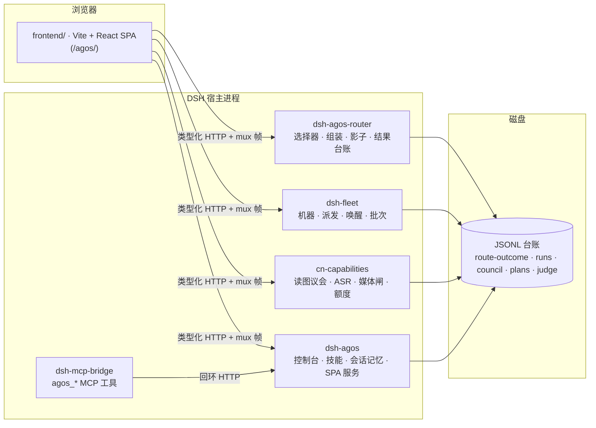

<div align="center">

[](README.md) &nbsp; [](README.zh-CN.md)

</div>

<p align="center">
  
</p>

# AgOS — 跑在 DeepSeek Harness 上的「诚实优先」Agent 操作系统甲板

### 一块遥测甲板、五个宿主插件,和一条硬规矩:屏幕上不许出现数据证明不了的话。

<p align="center">
  
  
  
  
  
  
</p>

> **一个立场**:大多数 agent 仪表盘是乐观主义小说——背后没有探针的绿色徽章、拿三个样本排的排行榜、手打出来的「97% 健康」。AgOS 押相反的注:当 UI **被禁止装饰**的那一刻,Agent 操作系统才开始值得信任。屏上每个数字都从磁盘上的台账推导;缺失的字段渲染成**「未采集」**而不是编造的零;模型给的建议先被记录、再谈信任——先影子、后接线。

---

## 摘要

**AgOS** 是 [DeepSeek Harness](https://github.com/deepseek-ai/deepseek-harness)(DSH)运行时之上的单用户 Agent OS 层。它用一块完整的**遥测甲板**替换原生 Web UI——多模态对话、子代理谱系、机器编队、模型路由、技能、记忆工作台——背后是五个 DSH 插件,把一切暴露为可审计的 JSONL 台账与带类型的 HTTP 路由。

这个项目把一个问题做到了端到端:**如果「编造」是一种构建错误,agent 驾驶舱会长成什么样?** 这里给出的答案包括:屏上字符串不是由同屏数据算出就让 CI 变红的仓级静态锁;让模型路由建议「只记录、不驱动」的**影子模式**;以及记忆抽取规则改动前必须重新通过的带标注语料的「尺」。

---

## 1. 十二个面

甲板跑在 `http://127.0.0.1:3091/agos/`,与后端 1:1 映射——没有任何一页背后没有真实数据源。

| 面 | 内容 | 后端 |
|---|---|---|
| **对话流** | 多模态转录(文本 · 图片 · 语音),审批面板、权限裁决注解、会话回收站、语音片段留痕 | 宿主 mux + `dsh-agos` |
| **概览** | 四个台账汇合的注意力收件箱(谱系失败 / 待回填路由 / 技能漂移 / 被标记评审),每个来源带 `ready / stale / absent` 三态 | `/api/agos/overview` + 三台账 |
| **机器与机架** | Homelab 编队:可达性、网络唤醒、在途负载、带成本确认的批量派发 | `dsh-fleet` |
| **路由决策** | 每次模型路由决策一行台账:pick、置信、理由、来源、结果回填;影子行明确标注「只是建议,没驱动任何东西」 | `dsh-agos-router` |
| **结果覆盖** | 五家异构台账归一成七字段结果表——刻意**不做**语义合并 | `outcomes.js` 派生器 |
| **会话 / 谱系 / 轨迹 / 计划** | 实时会话矩阵、子代理家谱、时间线、计划档案 | 宿主 RPC + 台账 |
| **技能** | 注册表审计(模型根 vs 控制台根、内容漂移检测)+ 一个只会「提案」的工作室 | `dsh-agos` |
| **读图议会** | 多模型看图评审,仲裁人逐评委标注疑似编造 | `cn-capabilities` |
| **记忆工作台** | 情节 / 语义 / 技能记忆的 wikilink 图谱 + 检查器 | `dsh-civ` 记忆路由 |

## 2. 诚实契约

这些不是风格建议——每一条都有让构建变红的测试:

1. **屏上断言必须由同屏数据算出。** 谈论一批数据的句子是载荷的函数,不是字符串常量;仓级 TypeScript AST 扫描器拒绝硬编码结论文案。
2. **缺席 ≠ 零 ≠ 假。** 每个可空字段有三种渲染态;「未采集」是有自己文案的一等 UI 状态。
3. **写端点隔离。** 所有写请求集中在一个文件,由 AST 锁把守(白名单字面量、禁别名、禁拼接);模型路由的 `decide` 端点**从构造上就无法从 UI 到达**——那个字符串字面量本身在全仓被禁。
4. **建议被记录,不被服从。** 路由选择器跑**影子模式**:每次派发检查调用一次,连同用户的真实选择一起写进台账——一致性是被测量的,不是被假设的。只有建议的机器真的跑了批次,终态才回填到建议头上;跑在别的机器上的批次永远不给建议记分。
5. **启发式规则带尺。** 会话记忆抽取器带着标注语料、逐样本通过基线和 `acceptEdit` 门:任何原本通过的样本回归即红——提升不能抵消回归,接受新基线是一次显式的、署名的动作。
6. **安全闸按闸测试。** 媒体路由对内容寻址文件做魔数嗅探,调用方声称的 MIME 只是「待核实的期望」;穿越、软链、双扩展、伪造类型各有专门单测。

## 3. 架构



- **`frontend/`** — Vite + React SPA;DSH API 契约 vendored 并钉版本(`UPSTREAM.pin`),`npm run verify` 含对上游的零漂移检查。
- **`plugins/`** — 五个 DSH 插件(纯 ESM,宿主依赖由 DSH profile 提供);插件间耦合走共享台账文件,不走 import。
- **`regression/`** — 驱动真实 Chrome 的 41 步全站回归(断内容,不是「点得动」)+ macOS 壳。
- **`scripts/`** — `iterate.sh`(构建 → 部署 → 插件字节真变了才重启 → 健康检查)、`deploy-plugins.sh`(按校验和判漂移)、`test-all.sh`。

## 4. 快速开始

需要:DSH 宿主(DSH Desktop 或 `@deepseek-ai/dsh`)、Node ≥ 22、一个 DSH profile 目录。

```bash
git clone https://github.com/LeoLin990405/agos && cd agos

# 前端
cd frontend && npm install && npm run build && cd ..

# 插件 → 你的 DSH profile(拷贝而非软链:宿主按插件文件的 realpath
# 向上解析 @deepseek-ai/*,插件必须住在 profile 目录树里)
scripts/deploy-plugins.sh

# 在 profile 的 package.json / cordis.patch.yml 里注册这五个插件,然后
dsh web --port 3091 --no-open
# → http://127.0.0.1:3091/agos/
```

日常迭代一条命令:

```bash
scripts/iterate.sh   # 构建 → 部署 → 插件字节变了才重启 3091 → 健康检查
```

只改前端永远不用重启——SPA 每个请求都从磁盘读。

## 5. 开发

```bash
scripts/dev-links.sh   # 一次性:让插件单测在仓内解析到宿主包
scripts/test-all.sh    # 前端 verify(含契约零漂移)+ 五套插件测试 + 部署漂移
```

测试面一览:**583** 条单测(前端 286 / 插件 297)、归档会话回放不变量、fold 金标字节级比对、41 步浏览器回归。记忆尺套件在本地语料(由 `mine.mjs` 从你自己的会话归档生成)缺席时自动跳过。

## 6. 用一段话说清影子路由

当你检查一次编队派发时,AgOS 会问一个小模型(StepFun `step-3.7-flash`,1024 max tokens,一次调用)它会选哪台机器——然后除了记下来,什么都不做。台账行记录建议、理由、它看到的候选、以及它和你实际选择是否一致;如果批次后来真的跑在建议的那台机器上,终态会回填到这一行。日积月累,这产出唯一能诚实支撑「自动路由」的东西:在选择器获得任何权力**之前**,积累一份真实决策配真实结果的记录。

## 许可与致谢

- [MIT](LICENSE)。
- `frontend/src/contract/` 下的 API 契约 vendored 自 [deepseek-harness](https://github.com/deepseek-ai/deepseek-harness)(MIT,© DeepSeek),由 `npm run vendor:diff` 保证零漂移。
- 构建于 DeepSeek Harness 插件运行时(`cordis`)之上;宿主包(`@deepseek-ai/*`)由你的 DSH 安装提供。
